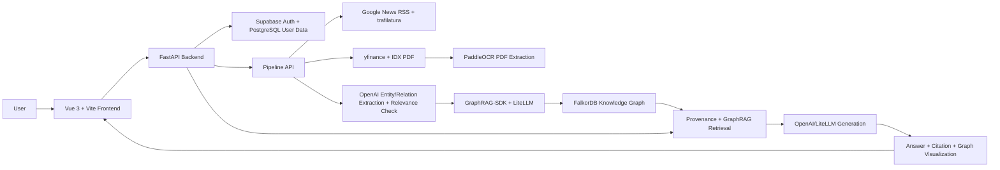

<<<<<<< HEAD
# frontend

This template should help get you started developing with Vue 3 in Vite.

## Recommended IDE Setup

[VS Code](https://code.visualstudio.com/) + [Vue (Official)](https://marketplace.visualstudio.com/items?itemName=Vue.volar) (and disable Vetur).

## Recommended Browser Setup

- Chromium-based browsers (Chrome, Edge, Brave, etc.):
  - [Vue.js devtools](https://chromewebstore.google.com/detail/vuejs-devtools/nhdogjmejiglipccpnnnanhbledajbpd)
  - [Turn on Custom Object Formatter in Chrome DevTools](http://bit.ly/object-formatters)
- Firefox:
  - [Vue.js devtools](https://addons.mozilla.org/en-US/firefox/addon/vue-js-devtools/)
  - [Turn on Custom Object Formatter in Firefox DevTools](https://fxdx.dev/firefox-devtools-custom-object-formatters/)

## Type Support for `.vue` Imports in TS

TypeScript cannot handle type information for `.vue` imports by default, so we replace the `tsc` CLI with `vue-tsc` for type checking. In editors, we need [Volar](https://marketplace.visualstudio.com/items?itemName=Vue.volar) to make the TypeScript language service aware of `.vue` types.

## Customize configuration

See [Vite Configuration Reference](https://vite.dev/config/).

## Project Setup

```sh
npm install
```

### Compile and Hot-Reload for Development

```sh
npm run dev
```

### Type-Check, Compile and Minify for Production

```sh
npm run build
```
=======
# StockGraph

## Overview

StockGraph adalah aplikasi analisis saham Indonesia berbasis GraphRAG yang
menggabungkan berita relevan, laporan keuangan, knowledge graph, dan citation.
Aplikasi ini membantu pengguna memahami faktor, risiko, konteks fundamental,
serta hubungan antar-entitas yang berkaitan dengan emiten Bursa Efek Indonesia
(BEI).

StockGraph dibuat untuk kebutuhan riset, edukasi, dan analisis informasi. Output
sistem bersifat informatif dan bukan rekomendasi investasi, saran beli/jual, atau
jaminan hasil investasi.

## Key Features

- Chat analisis saham berbasis ticker dan pertanyaan pengguna.
- Pipeline retrieval berita dan laporan keuangan untuk membangun konteks
  analisis.
- Citation sumber yang dapat diklik melalui source card dan source detail modal.
- Knowledge Graph Explorer untuk melihat node, relasi, evidence, dan entitas
  terkait.
- Overview graph dan focus graph ketika pengguna memilih node tertentu.
- Entity search, filter tipe node, related entities, dan evidence/source panel
  pada graph explorer.
- Insight Cepat yang menampilkan sentimen berita, entitas utama, jumlah node,
  jumlah relasi, dan key financials.
- Riwayat percakapan berbasis user.
- Authentication menggunakan Supabase Auth yang disinkronkan ke user lokal.
- Streaming response melalui WebSocket dengan progress/loading stage.
- Follow-up question dalam conversation yang sama dengan history percakapan.

## Supported Stocks / Scope

Ticker yang tersedia pada frontend saat ini:

```text
BBCA, BBRI, BMRI, BBNI, TLKM, ASII, ADRO, AMMN, ANTM, ARTO,
BRIS, BRPT, BUKA, CPIN, GOTO, ICBP, INCO, INDF, INKP, ISAT,
KLBF, MDKA, MEDC, PGAS, PTBA, SMGR, UNTR, UNVR
```

Mapping sektor yang ditemukan di backend mencakup sebagian ticker:

- Perbankan: `BBCA`, `BBRI`, `BMRI`, `BBNI`, `BNGA`, `BTPS`, `PNBN`, `BJTM`
- Telekomunikasi: `TLKM`, `EXCL`, `ISAT`
- Otomotif: `ASII`, `AUTO`
- Consumer: `UNVR`, `ICBP`, `MYOR`, `HMSP`
- Teknologi: `GOTO`, `BUKA`

Sumber data yang digunakan:

- Berita: Google News RSS dengan filter domain `bisnis.com`,
  `cnbcindonesia.com`, `kontan.co.id`, `antaranews.com`,
  `bloombergtechnoz.com`, dan `idxchannel.com`.
- Fundamental: yfinance untuk data emiten `.JK`.
- Laporan keuangan: PDF laporan keuangan IDX secara opsional jika URL IDX
  tersedia.

Batasan scope:

- Cakupan emiten mengikuti daftar frontend dan input pipeline.
- Nama perusahaan lengkap sebagian diambil secara dinamis dari yfinance.
- Data berita dan laporan keuangan bergantung pada ketersediaan sumber saat
  pipeline dijalankan.
- Laporan keuangan PDF diproses dengan PaddleOCR pada saat ingestion.

## System Architecture



Komponen utama:

- Frontend: Vue 3, Vite, PrimeVue.
- Backend: FastAPI.
- Auth/session user: Supabase Auth dan PostgreSQL.
- GraphRAG: GraphRAG-SDK dengan LiteLLM.
- Graph database: FalkorDB.
- PDF extraction: PaddleOCR dan PaddlePaddle runtime.
- News crawling: Google News RSS, feedparser, googlenewsdecoder, trafilatura.
- LLM provider: OpenAI SDK dan LiteLLM.

Tidak ditemukan pemakaian aktif ChromaDB, LangChain, atau LangGraph pada
codepath aplikasi saat ini, walaupun beberapa package dapat muncul sebagai
dependency/transitive dependency.

## Data Processing Pipeline

1. Pengguna memilih ticker dan menulis pertanyaan.
2. Backend mengambil data fundamental dari yfinance.
3. Jika `try_idx_pdf` aktif, backend mencoba mengambil PDF laporan keuangan IDX
   untuk tahun historical yang tersedia.
4. PDF laporan keuangan diekstrak menggunakan PaddleOCR dan metadata halaman
   disimpan.
5. LLM membuat keyword pencarian berita berdasarkan ticker dan pertanyaan.
6. Google News RSS dicrawl, URL Google News didecode, konten artikel diekstrak,
   lalu artikel dideduplikasi.
7. LLM mengekstrak entity dan relationship dari berita serta data fundamental.
8. Relevance checker menilai apakah hasil ekstraksi relevan terhadap emiten
   target dengan threshold pipeline.
9. Dokumen berita dan laporan keuangan diubah menjadi `IngestDocument` per
   tahun.
10. GraphRAG-SDK melakukan ingest dokumen menggunakan LLM dan embedding model
    yang dikonfigurasi.
11. Graph disimpan di FalkorDB dengan nama per tahun, misalnya
    `stockgraph_2024`.
12. Provenance registry lokal menyimpan node, relasi, artikel, dan source ID
    untuk graph explorer dan evidence retrieval.
13. Saat user bertanya, orchestrator mengambil konteks berita dan financial dari
    provenance retrieval serta GraphRAG semantic context bila tersedia.
14. Manager agent menyusun jawaban akhir dengan citation sumber yang divalidasi.

## PDF Extraction

StockGraph menggunakan PaddleOCR untuk mengekstrak teks dan struktur dokumen
dari laporan keuangan PDF. Hasil ekstraksi disimpan per halaman bersama metadata
dokumen untuk mendukung retrieval dan citation.

Implementasi PDF extraction saat ini:

- Library utama: PaddleOCR `PPStructureV3`.
- PaddleOCR diinisialisasi secara lazy dan instance pipeline digunakan ulang
  dalam proses/worker yang sama.
- Input PDF dapat berupa path file atau bytes; bytes disimpan sementara sebagai
  file PDF lokal untuk diproses oleh PaddleOCR.
- Whitespace dan baris kosong dibersihkan sebelum teks dipakai.
- Hasil ekstraksi disimpan per halaman.
- Metadata halaman mencakup `source_file`, `page_number`,
  `extraction_method=paddleocr`, `document_type`, `document_year`,
  `document_period`, `ticker`, `company`, `ocr_confidence`, `needs_review`, dan
  `extraction_warning`.
- Pipeline memanfaatkan document layout dan table parsing yang tersedia pada
  PaddleOCR untuk membantu mempertahankan struktur laporan keuangan.
- Tabel yang berhasil dibaca dikonversi menjadi Markdown/text terstruktur untuk
  chunking dan retrieval.
- Halaman kosong, terlalu pendek, confidence rendah, atau struktur tabel yang
  bermasalah ditandai `needs_review=True`.
- Jika satu halaman gagal diparsing, halaman tersebut diberi warning/error dan
  halaman lain tetap diproses.
- Jika satu PDF rusak, batch extraction tetap dapat memproses PDF berikutnya.

Pipeline tidak menggunakan PyMuPDF, Tesseract, EasyOCR, atau layanan OCR cloud
untuk ekstraksi laporan keuangan PDF. OCR hanya berjalan pada proses ingestion
dokumen, bukan setiap user mengirim pertanyaan.

## Knowledge Graph

Entity type yang dideklarasikan pada schema GraphRAG:

- `Stock`
- `Company`
- `Person`
- `Policy`
- `Event`
- `FinancialMetric`
- `NewsArticle`
- `Sector`

Relationship type yang dideklarasikan:

- `MANAGES`
- `ISSUES`
- `AFFECTS`
- `REPORTS_FINANCIAL`
- `MENTIONS`
- `COMPETES_WITH`
- `BELONGS_TO`
- `REPRESENTS`

Provenance graph lokal juga membuat relasi pendukung seperti:

- `COVERS`
- `PUBLISHED_IN`
- `HAS_PERIOD`
- `FOR_PERIOD`

Graph digunakan untuk:

- menyimpan konteks berita dan laporan keuangan per tahun;
- menghubungkan emiten dengan event, policy, person, company, artikel, dan
  metric financial;
- memberi konteks retrieval untuk news agent dan financial agent;
- menyediakan source/evidence untuk citation;
- menampilkan overview graph dan focus graph pada Knowledge Graph Explorer.

Node dan relasi divalidasi menggunakan entity validation dan relevance filtering
sebelum masuk ke graph/provenance registry.

## Tech Stack

| Layer | Technology | Purpose |
| ----- | ---------- | ------- |
| Backend | Python, FastAPI | API utama, pipeline, WebSocket chat |
| Frontend | Vue 3, Vite, TypeScript, PrimeVue | UI aplikasi, chat, graph explorer, source panel |
| Auth | Supabase Auth | Login/session browser dan validasi access token |
| User data | PostgreSQL, SQLAlchemy async | User lokal, conversation, message history |
| GraphRAG | GraphRAG-SDK | Ingestion dan query graph berbasis dokumen |
| LLM abstraction | LiteLLM | LLM dan embedder untuk GraphRAG-SDK |
| LLM provider | OpenAI SDK | Agent chat, keyword extraction, entity/relation extraction, relevance check |
| Embedding | `openai/text-embedding-3-small` | Embedding untuk GraphRAG-SDK |
| Graph database | FalkorDB | Penyimpanan knowledge graph per tahun |
| PDF extraction | PaddleOCR, PaddlePaddle | OCR, document layout parsing, dan table parsing best-effort |
| News ingestion | feedparser, googlenewsdecoder, trafilatura | Google News RSS crawling dan article text extraction |
| Financial data | yfinance, requests | Data fundamental `.JK` dan optional IDX PDF download |
| Frontend testing | Vitest, Vue Test Utils | Unit test frontend |

## Project Structure

```text
stockgraph/
├── app/
│   ├── core/
│   │   ├── agent/              # Orchestrator, news/financial/manager agents
│   │   └── extractor/          # LLM extraction, relevance check, key financials
│   ├── database/               # SQLAlchemy config/session
│   ├── models/                 # User, conversation, message ORM models
│   ├── routes/                 # FastAPI routes
│   ├── services/
│   │   ├── crawler/            # News and financial fetchers
│   │   ├── database/           # GraphRAG engine, graph builder, evidence retrieval
│   │   ├── ui/                 # Streamlit/legacy local UI server files
│   │   ├── paddleocr_service.py # PaddleOCR document extraction service
│   │   ├── pdf_extractor.py    # Compatibility entry points for PDF extraction
│   │   └── supabase_auth_service.py
│   └── main.py                 # Unified FastAPI app
├── frontend/
│   ├── src/                    # Vue application source
│   └── package.json            # Frontend scripts and dependencies
├── test/                       # Backend tests found in repository
├── database.sql                # Database schema/bootstrap SQL
├── pyproject.toml              # Python dependencies
├── requirements.txt            # Minimal backend requirements
├── .env.example                # Environment variable template
└── README.md
```

## Installation and Setup

### Prerequisites

- Python `>=3.13`
- `uv`
- Node.js compatible with the frontend package requirement:
  `^20.19.0 || >=22.12.0`
- PostgreSQL
- FalkorDB
- OpenAI API key or compatible configuration used by LiteLLM/OpenAI SDK
- Supabase project for authentication

### 1. Clone repository

```bash
git clone <repository-url>
cd stockgraph
```

### 2. Install backend dependencies

```bash
uv sync
```

Alternatively, a minimal `requirements.txt` is available for standard Python
install workflows:

```bash
pip install -r requirements.txt
```

The full project dependencies are defined in `pyproject.toml`.

PaddleOCR dependencies are part of the project dependency list:

```bash
uv add "paddleocr>=3.3.0" "paddlepaddle>=3.0.0"
```

PaddleOCR may download OCR/layout/table models on first use. This happens during
explicit PDF ingestion, not on every chat request.

### 3. Configure environment variables

Copy `.env.example` to `.env`, then fill only the values required for your local
setup. Do not commit `.env`.

For the frontend, create `frontend/.env` with the Vite variables listed in the
Environment Variables section.

### 4. Prepare PostgreSQL

Create the configured PostgreSQL database and apply `database.sql` if needed.
The FastAPI app also calls SQLAlchemy `create_all` on startup.

### 5. Run FalkorDB

No `Dockerfile` or `docker-compose.yml` is included in this repository. If you
use Docker locally, FalkorDB can be run with the official image:

```bash
docker run -p 6379:6379 -p 3000:3000 --name falkordb falkordb/falkordb:latest
```

If the container already exists:

```bash
docker start falkordb
```

### 6. Run backend

```bash
uv run uvicorn app.main:app --reload --port 8000
```

Backend local URL:

```text
http://localhost:8000
```

### 7. Install and run frontend

```bash
cd frontend
npm install
npm run dev
```

Vite will print the local frontend URL. The default development URL is commonly:

```text
http://localhost:5173
```

## Environment Variables

Do not put secret values in documentation, commits, screenshots, or issue logs.
Only variable names are listed below.

| Variable | Purpose | Required |
| -------- | ------- | -------- |
| `OPENAI_API_KEY` | OpenAI SDK calls for agents, extraction, relevance, and key financial extraction | Yes for LLM features |
| `NEWS_MODEL` | Model for News Agent | Optional |
| `FINANCIAL_MODEL` | Model for Financial Agent | Optional |
| `MANAGER_MODEL` | Model for Manager Agent | Optional |
| `IDX_EXTRACTOR_MODEL` | Model for LLM-assisted key financial extraction from IDX PDF text | Optional |
| `DB_HOST` | PostgreSQL host | Yes |
| `DB_PORT` | PostgreSQL port | Yes |
| `DB_USER` | PostgreSQL user | Yes |
| `DB_PASSWORD` | PostgreSQL password | Yes |
| `DB_NAME` | PostgreSQL database name | Yes |
| `DB_POOL_SIZE` | SQLAlchemy pool size | Optional |
| `DB_MAX_OVERFLOW` | SQLAlchemy max overflow | Optional |
| `DB_ECHO` | SQL logging toggle | Optional |
| `FALKORDB_HOST` | FalkorDB host | Yes for GraphRAG |
| `FALKORDB_PORT` | FalkorDB port | Yes for GraphRAG |
| `FALKORDB_CONNECT_TIMEOUT` | FalkorDB connection timeout | Optional |
| `FALKORDB_HEALTH_CHECK_INTERVAL` | FalkorDB health check interval | Optional |
| `STOCKGRAPH_INGEST_TIMEOUT_SECONDS` | GraphRAG ingest timeout | Optional |
| `STOCKGRAPH_FINALIZE_TIMEOUT_SECONDS` | GraphRAG finalize timeout | Optional |
| `STOCKGRAPH_REGISTRY` | Local registry path for available graph years | Optional |
| `STOCKGRAPH_PROVENANCE_REGISTRY` | Local provenance registry path for evidence graph | Optional |
| `STOCKGRAPH_PADDLEOCR_LANG` | PaddleOCR language/model option; default uses `en` for Latin text and numbers | Optional |
| `STOCKGRAPH_PADDLEOCR_DEVICE` | Optional PaddleOCR device setting, such as CPU/GPU value supported by PaddleOCR | Optional |
| `STOCKGRAPH_PADDLEOCR_USE_DOC_ORIENTATION` | Toggle PaddleOCR document orientation classification | Optional |
| `STOCKGRAPH_PADDLEOCR_USE_DOC_UNWARPING` | Toggle PaddleOCR document unwarping | Optional |
| `STOCKGRAPH_PADDLEOCR_USE_TEXTLINE_ORIENTATION` | Toggle PaddleOCR text line orientation | Optional |
| `STOCKGRAPH_PADDLEOCR_USE_TABLE_RECOGNITION` | Toggle PaddleOCR table recognition | Optional |
| `STOCKGRAPH_PADDLEOCR_USE_FORMULA_RECOGNITION` | Toggle PaddleOCR formula recognition | Optional |
| `SUPABASE_URL` | Supabase project URL for backend token validation | Yes for auth |
| `SUPABASE_ANON_KEY` | Supabase anon key for backend token validation | Yes for auth |
| `SUPABASE_AUTH_TIMEOUT_SECONDS` | Supabase auth request timeout | Optional |
| `FRONTEND_URL` | Frontend URL used by app/auth flows | Optional |
| `LOG_LEVEL` | Backend logging level | Optional |
| `PORT` | Optional port used by legacy `app.services.ui.server` entrypoint | Optional |
| `VITE_API_BASE_URL` | Frontend API base URL | Yes for frontend |
| `VITE_SUPABASE_URL` | Supabase URL used by frontend | Yes for frontend auth |
| `VITE_SUPABASE_ANON_KEY` | Supabase anon key used by frontend | Yes for frontend auth |

`HF_TOKEN` is not required by StockGraph source code. If a third-party dependency
or public model download flow asks for a Hugging Face token in a specific
environment, configure it outside the repository and do not commit it.

## Usage

1. Open the frontend application and login through the configured Supabase Auth
   flow.
2. Choose or enter one or more stock tickers.
3. Ask an analysis question.
4. Wait for the analysis progress and streaming response.
5. Read the generated answer and click inline/source citations to inspect the
   supporting evidence.
6. Use the Knowledge Graph Explorer to inspect entities, relationships, evidence,
   and graph focus around selected nodes.
7. Continue with follow-up questions in the same conversation.

Example questions:

```text
Apa risiko utama TLKM berdasarkan berita dan laporan keuangan?
```

```text
Apa faktor yang memengaruhi kinerja BBNI?
```

```text
Bagaimana hubungan antara suatu event dengan emiten terkait?
```

## API Endpoints

Main endpoints found in the FastAPI app:

- `GET /health`
- `GET /api/years`
- `GET /api/validate/{year}`
- `POST /api/query`
- `GET /api/graph/explore`
- `GET /api/key-financials/{stock_code}`
- `POST /api/merger/pipeline`
- `POST /api/pipeline`
- `GET /api/v1/users/me`
- `PATCH /api/v1/users/me`
- `POST /api/v1/conversations`
- `GET /api/v1/conversations/users/{user_id}`
- `GET /api/v1/conversations/{conversation_id}/messages`
- `POST /api/v1/conversations/{conversation_id}/messages/log`
- `WebSocket /ws/chat`

Most application endpoints require a valid Supabase-authenticated user.

## Limitations

- Cakupan emiten pada UI terbatas pada ticker yang didefinisikan di frontend.
- Mapping sektor backend belum mencakup seluruh ticker frontend.
- Nama perusahaan dan data fundamental bergantung pada ketersediaan yfinance.
- Berita bergantung pada hasil Google News RSS, domain filter, dan artikel yang
  berhasil diekstrak.
- PDF IDX tidak selalu tersedia untuk semua emiten dan tahun.
- Kualitas OCR dipengaruhi kualitas scan, resolusi PDF, layout, dan struktur
  tabel.
- Dokumen dengan tabel kompleks atau scan berkualitas rendah dapat memerlukan
  pemeriksaan ulang.
- Angka dari hasil OCR diperlakukan sebagai teks sumber dan tetap perlu validasi
  sebelum dipakai untuk keputusan finansial.
- Kualitas entity dan relationship bergantung pada hasil ekstraksi model LLM.
- Graph dan jawaban dapat berubah ketika sumber baru masuk atau pipeline
  dijalankan ulang.
- Performa dipengaruhi oleh jumlah dokumen, ukuran graph, koneksi FalkorDB, dan
  provider LLM.
- StockGraph bukan sistem rekomendasi investasi.
- RAGAS ditemukan sebagai dependency, tetapi implementasi evaluasi aktif belum
  ditemukan pada codebase saat ini.

## Disclaimer

StockGraph dibuat untuk tujuan riset, edukasi, dan analisis informasi. Output
sistem bukan saran investasi, rekomendasi beli/jual, ataupun jaminan hasil
investasi. Pengguna tetap perlu melakukan riset mandiri, memeriksa sumber resmi,
dan mempertimbangkan risiko sebelum mengambil keputusan finansial.

## Troubleshooting

### Backend tidak bisa terhubung ke FalkorDB

Pastikan FalkorDB berjalan dan `FALKORDB_HOST` serta `FALKORDB_PORT` sesuai.
Jika menggunakan Docker lokal:

```bash
docker start falkordb
```

### Tidak ada tahun graph tersedia

Jalankan pipeline terlebih dahulu melalui UI atau endpoint
`POST /api/merger/pipeline`. Graph per tahun baru tersedia setelah ingestion
berhasil.

### Environment variable belum dikonfigurasi

Pastikan `.env` backend dan `frontend/.env` sudah dibuat. Jangan menaruh nilai
secret di README, commit, atau log publik.

### PDF gagal diekstrak

Pipeline PaddleOCR akan mencatat error pada PDF atau halaman yang bermasalah.
Halaman kosong, terlalu pendek, atau confidence rendah ditandai
`needs_review=True`. Jika model belum tersedia secara lokal, PaddleOCR dapat
mengunduh model pada penggunaan pertama.

### Frontend tidak dapat terhubung ke backend

Pastikan backend berjalan di URL yang sama dengan `VITE_API_BASE_URL`, dan
pastikan Supabase session tersedia jika endpoint membutuhkan authentication.

### Port sudah digunakan

Jalankan backend atau frontend pada port lain sesuai opsi tool masing-masing,
atau hentikan proses yang sedang memakai port tersebut.

## Development Notes

- Frontend test command tersedia di `frontend/package.json`:

```bash
cd frontend
npm run test
```

- Frontend build command:

```bash
cd frontend
npm run build
```

- Backend memiliki folder `test/`, tetapi tidak ditemukan script test khusus di
  `pyproject.toml` atau `requirements.txt`.
- Simpan secret hanya di `.env` atau environment lokal.
- `.env` tidak boleh di-commit.
- Jangan menampilkan API key, token, password, atau connection string pada log
  publik.

## License

License information has not been specified yet.
>>>>>>> 290e5584905b63aa2eed29ba1a7a0a613de94f40
