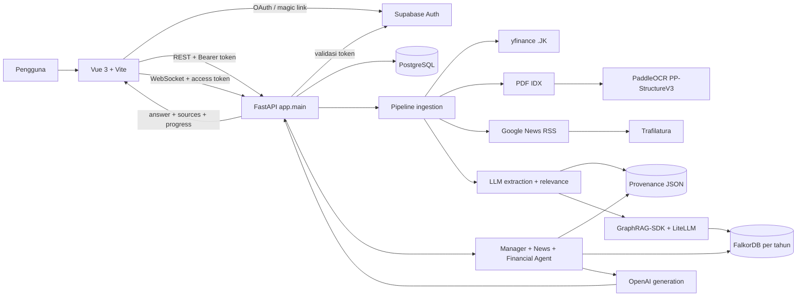
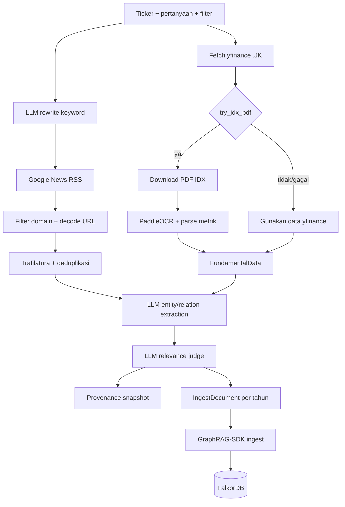
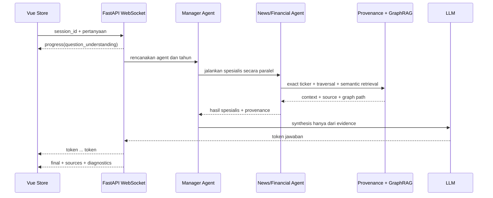

# Ringkasan Teknis dan Akademik Deployment StockGraph dengan Metode Waterfall

## Ringkasan Eksekutif

StockGraph adalah aplikasi tanya jawab saham Indonesia yang mengintegrasikan frontend Vue 3, backend FastAPI, PostgreSQL, Supabase Auth, GraphRAG-SDK, FalkorDB, layanan OpenAI/LiteLLM, pengumpulan berita, pengambilan data fundamental, dan ekstraksi PDF berbasis PaddleOCR. Dalam kerangka CRISP-DM, aplikasi ini merupakan artefak pada tahap *Deployment*. Untuk menjelaskan pembangunan artefak web secara lebih rinci, tahap tersebut dapat diuraikan kembali menggunakan urutan Waterfall: analisis kebutuhan, perancangan, implementasi, integrasi dan pengujian, penerapan, pengoperasian, serta pemeliharaan.

Audit repository menunjukkan bahwa entry point backend aktif adalah `app/main.py` dengan objek `app = create_app()`, sedangkan frontend aktif berada di `src/` dan dibangun dari `package.json` pada akar repository. Backend menggabungkan API CRUD PostgreSQL, validasi token Supabase, pipeline ingestion, endpoint query dan eksplorasi graph, endpoint key financials, serta WebSocket untuk progress dan streaming jawaban. Pipeline menerima ticker, pertanyaan, jumlah artikel, ambang relevansi, dan opsi PDF IDX; mengambil data yfinance menggunakan suffix `.JK`; mencoba PDF IDX bila diaktifkan; mengambil berita dari Google News RSS; mengekstrak isi artikel dengan Trafilatura; melakukan ekstraksi entitas/relasi dan pemeriksaan relevansi menggunakan LLM; kemudian mengingest dokumen per tahun ke FalkorDB melalui GraphRAG-SDK. Registry JSON lokal mempertahankan provenance untuk retrieval deterministik dan visualisasi.

Pada alur tanya jawab, Manager Agent menentukan tahun dan spesialis yang digunakan. News Agent dan Financial Agent menggabungkan retrieval berbasis ticker/provenance, traversal graph maksimal tiga hop pada fungsi lokal, dan semantic retrieval GraphRAG bila graph tahun tersedia. Context kemudian dideduplicasi, difilter, direrank, dibatasi oleh anggaran context, dan diserahkan kepada Manager Agent untuk menyusun jawaban akhir. Sumber dibentuk menjadi struktur provenance yang dapat dirender sebagai source card dan modal citation oleh frontend.

Repository menyediakan bukti implementasi dan pengujian yang cukup kuat, tetapi belum membuktikan deployment produksi/server. Build frontend yang dijalankan saat audit berhasil. Koleksi Vitest melaporkan 28 file dan 126 test lulus, tetapi angka tersebut mencakup pengulangan test dari tiga salinan frontend; implementasi aktif `src/` sendiri memuat 9 file dan 41 kasus test. Enam file test backend aktif yang dipilih berdasarkan import `app.*` menghasilkan 25 test lulus dan satu warning deprecation. Full collection `pytest` belum bersih karena file lama masih mengimpor paket `agents.*` yang sudah tidak ada dan folder duplikat ikut terkoleksi. Pada saat audit, tidak ada service pada port 5432, 6379, 8000, 5173, atau 5174 yang dapat dikonfirmasi dan `GET /health` tidak dapat diakses. Oleh sebab itu, dokumen ini tidak menyatakan bahwa deployment produksi sedang berjalan.

Tidak ditemukan `Dockerfile`, `docker-compose.yml`, reverse proxy, konfigurasi cloud, CI/CD, backup otomatis, atau monitoring eksternal. Docker hanya didokumentasikan sebagai cara manual menjalankan image resmi FalkorDB. Selain itu ditemukan beberapa ketidaksesuaian yang penting untuk dicatat: duplikasi source di `frontend/` dan `frontend/frontend/`, konflik Git yang belum diselesaikan di `.gitignore`, tipe `graphs_built.errors` frontend yang tidak sama dengan response backend, dua definisi health check dengan semantik berbeda, petunjuk README yang mengarah ke salinan frontend, serta pernyataan README tentang RAGAS yang sudah tidak sesuai dengan folder `evaluation/` dan artefak hasil terbaru.

## Ruang Lingkup dan Metode Audit Repository

Analisis memprioritaskan bukti dalam urutan: source code yang dipakai oleh entry point aktif, konfigurasi runtime, test dan hasil test yang dijalankan, artefak data, kemudian dokumentasi dan log historis. Direktori `.venv`, `node_modules`, cache, serta output build tidak dijadikan sumber implementasi. File `.env` tidak dibaca dan tidak ada credential yang disalin ke dokumen ini.

Repository memiliki perubahan lokal milik pengguna pada `app/services/database/retrieval_optimizer.py`. File tersebut dibaca untuk memahami codepath retrieval, tetapi tidak diubah. Dokumen ini juga membedakan tiga jenis bukti:

1. **Bukti implementasi aktif**, yaitu kode yang diimpor oleh `app.main:app` atau `src/main.ts`.
2. **Bukti artefak lokal**, misalnya `.stockgraph_registry.json`, `.stockgraph_graph.json`, dan `evaluation/results/summary.json`; artefak ini membuktikan bahwa proses pernah menghasilkan output, tetapi tidak membuktikan service eksternal sedang aktif.
3. **Bukti historis**, yaitu `backend_run.log` dan `frontend_run.log`; log tersebut berasal dari versi terdahulu sehingga tidak digunakan untuk mengklaim endpoint saat ini.

## Struktur Folder dan Komponen yang Dianalisis

```text
stockgraph/
├── app/
│   ├── main.py                         # entry point FastAPI aktif
│   ├── core/
│   │   ├── agent/                      # manager, news, financial, orchestrator
│   │   └── extractor/                  # entity/relation, relevance, key financials
│   ├── database/                       # konfigurasi dan session PostgreSQL
│   ├── dependencies/                   # dependency autentikasi FastAPI
│   ├── models/                         # ORM User, Conversation, Message
│   ├── repositories/                   # akses data SQLAlchemy
│   ├── routes/                         # endpoint CRUD, query, graph, pipeline
│   ├── schemas/                        # request/response Pydantic
│   ├── services/
│   │   ├── crawler/                    # berita dan fundamental
│   │   ├── database/                   # GraphRAG, graph builder, provenance retrieval
│   │   ├── paddleocr_service.py        # OCR PP-StructureV3
│   │   ├── pdf_extractor.py            # facade OCR aktif
│   │   └── supabase_auth_service.py    # validasi access token
│   └── utils/                          # logging, error, hashing legacy
├── src/                                # frontend Vue 3 aktif
│   ├── components/                     # chat, citation, graph, auth, layout
│   ├── composables/                    # alur halaman home dan result
│   ├── services/                       # REST, WebSocket, Supabase client
│   ├── stores/                         # auth, conversation, progress, streaming
│   ├── views/                          # Login, Callback, Home, Result
│   └── router/                         # route dan auth guard
├── test/                               # test backend aktif dan file test lama
├── evaluation/                         # pipeline dan artefak evaluasi RAGAS
├── database.sql                        # bootstrap schema PostgreSQL
├── .env.example                       # template konfigurasi
├── .stockgraph_registry.json           # registry tahun graph
├── .stockgraph_graph.json              # provenance lokal, diabaikan Git
├── package.json / package-lock.json     # frontend aktif
├── pyproject.toml / uv.lock             # dependency Python utama
├── requirements.txt                    # dependency backend minimal, tidak lengkap
└── frontend/                           # salinan bertingkat; bukan basis utama audit
```

Direktori `frontend/` bukan sekadar frontend tunggal. Di dalamnya terdapat salinan backend, test, frontend lain, dan bahkan `frontend/frontend/`. Hash beberapa file menunjukkan bahwa `frontend/frontend/src/main.ts` identik dengan `src/main.ts`, sedangkan `frontend/src/main.ts` berbeda. Karena build berhasil dijalankan dari akar dan entry point aktif juga berada di akar, pembahasan utama menggunakan `app/` dan `src/`. Duplikasi ini tetap dicatat sebagai risiko pemeliharaan dan penyebab pengumpulan test berulang.

## Pemetaan Tahap Waterfall terhadap Implementasi StockGraph

| Tahap Waterfall | Fokus pada StockGraph | Artefak utama |
| --- | --- | --- |
| Analisis kebutuhan | Aktor, input, output, layanan, batasan, keamanan, dan performa | route, schema, `.env.example`, `package.json`, `pyproject.toml` |
| Perancangan | Arsitektur frontend-backend, dataflow ingestion/retrieval, database, UI, API | struktur modul, model, schema GraphRAG, router, composable |
| Implementasi | Kode FastAPI, Vue, crawler, OCR, GraphRAG, agent, provenance | `app/`, `src/`, `database.sql` |
| Integrasi dan pengujian | Integrasi REST/WS/database/LLM/graph serta validasi unit/build | `test/`, test Vue, log, hasil perintah audit |
| Penerapan | Konfigurasi lokal, instalasi, startup service, health check | README, `.env.example`, package scripts, entry point |
| Pengoperasian | Urutan aksi pengguna sampai jawaban, citation, insight, dan follow-up | `useChatSession.ts`, `ResultView.vue`, WebSocket backend |
| Pemeliharaan | Logging, migration, refresh data, cache, dependency, kekurangan operasional | logger, migration, lockfile, health check, catatan audit |

# 4.X Deployment

## 4.X.1 Gambaran Umum Tahap Deployment

Deployment merupakan tahap akhir CRISP-DM yang mengubah hasil pemodelan dan evaluasi menjadi aplikasi yang dapat digunakan. Pada StockGraph, tahap tersebut tidak hanya berarti menyalakan server, tetapi mencakup penerjemahan pipeline penelitian menjadi sistem web: menerima masukan pengguna, mengumpulkan atau memperbarui evidence, membangun knowledge graph, menjalankan retrieval, mengoordinasikan agent, menyusun jawaban, menampilkan provenance, dan mempertahankan riwayat percakapan.

Penguraian dengan Waterfall berguna karena artefak web StockGraph memiliki urutan pengembangan yang dapat ditelusuri: kebutuhan ditetapkan dari fungsi aplikasi; kebutuhan tersebut diterjemahkan menjadi arsitektur dan kontrak API; rancangan diimplementasikan sebagai modul backend/frontend; modul diintegrasikan dan diuji; aplikasi disiapkan untuk runtime lokal; kemudian aspek pengoperasian dan pemeliharaan dianalisis. Penguraian ini tidak menggantikan CRISP-DM sebagai metodologi penelitian utama dan tidak mengulang evaluasi kualitas jawaban menggunakan RAGAS.

## 4.X.2 Analisis Kebutuhan Sistem

### A. Tujuan

Tahap analisis kebutuhan bertujuan menetapkan kemampuan yang harus tersedia agar pipeline GraphRAG dapat digunakan oleh pengguna melalui aplikasi web. Analisis meliputi aktor, masukan, keluaran, layanan eksternal, penyimpanan, keamanan, kinerja, runtime, dan batasan data.

### B. Aktivitas yang Dilakukan

Kebutuhan diturunkan dari route FastAPI, schema request/response, daftar ticker frontend, store Vue, konfigurasi environment, dependency, dan modul crawler/GraphRAG. Aktor utama adalah pengguna terautentikasi. Supabase berperan sebagai penyedia identitas, sedangkan PostgreSQL menyimpan profil lokal dan riwayat. Tidak ditemukan peran administrator atau pembagian hak akses berbasis role.

### C. Cara Pelaksanaan

Kebutuhan fungsional diterjemahkan menjadi route dan fitur UI berikut.

| Kategori | Kebutuhan | Bukti implementasi |
| --- | --- | --- |
| Autentikasi | Masuk melalui Google OAuth atau magic link; route privat dilindungi | `src/stores/useAuth.ts`, `src/router/index.ts`, `app/dependencies/auth.py` |
| Profil | Sinkronisasi identitas Supabase ke user lokal dan perubahan display name | `UserService.sync_supabase_user`, `PATCH /api/v1/users/me` |
| Input analisis | Memilih minimal satu ticker, menulis pertanyaan, mengatur jumlah artikel dan threshold | `HomeView.vue`, `useHomeAnalysis.ts`, `MergerPipelineRequest` |
| Ingestion | Mengambil berita, fundamental, PDF opsional, mengekstrak dan memfilter evidence | `run_merger_pipeline`, crawler dan extractor |
| Graph | Menyimpan dokumen per tahun dan menyediakan eksplorasi node/relasi | `GraphRAGEngine`, `graph_builder.py`, `/api/graph/explore` |
| Tanya jawab | Menentukan agent/tahun, mengambil context, dan menyusun jawaban | `Orchestrator`, Manager/News/Financial Agent |
| Streaming | Menampilkan progress terstruktur dan token jawaban | `/ws/chat`, `ChatSocketClient`, `AnalysisProgress.vue` |
| Provenance | Mengirim metadata sumber dan menampilkan card/modal citation | `response_formatter.py`, komponen citation |
| Insight | Menampilkan sentiment, entitas, jumlah node/relasi, dan key financials | `insight_snapshot.py`, `ResultView.vue` |
| Follow-up | Menggunakan session yang sama dan konteks ticker aktif | `SessionStore`, `buildFollowUpPrompt`, `streamQuestion` |
| Riwayat | Membuat conversation dan menyimpan pasangan user-bot | model/repository PostgreSQL dan `persistTurn` |

Kebutuhan nonfungsional yang benar-benar terlihat dalam kode adalah sebagai berikut.

| Aspek | Implementasi atau batasan | Bukti |
| --- | --- | --- |
| Keamanan | Bearer token Supabase untuk REST; token query parameter untuk WebSocket; ownership conversation diperiksa | `get_current_user`, `ws_chat`, service conversation/message |
| Validasi | Pydantic membatasi list ticker, threshold 0–1, artikel 1–20; frontend menolak pertanyaan/ticker kosong | `MergerPipelineRequest`, `useHomeAnalysis.ts` |
| Availability | Backend melakukan inisialisasi GraphRAG secara *best effort* dan menyediakan jawaban fallback | `_setup_engine`, `_fallback_reply`, `ws_chat` |
| Kinerja | Async API, operasi blocking dipindah ke thread, crawler maksimal tiga worker, cache query 64 item, key financial TTL satu jam | route pipeline, crawler, engine, endpoint key financial |
| Batas waktu | Chat 120 detik; pipeline UI 10 menit; timeout ingestion/finalize dan health Falkor dapat dikonfigurasi | `useChatSession.ts`, `graphrag_engine.py`, `.env.example` |
| Observability | Log terpusat ke stdout; diagnostic retrieval dan debug JSON | `app/utils/logger.py`, `retrieval_debug.py`, orchestrator |
| Aksesibilitas UI | status `aria-live`, modal berfokus, Escape/Tab handling, link `noopener` | progress dan citation component |
| Responsivitas | media query pada ResultView, graph explorer, citation modal, dan layout lain | file Vue terkait |
| Internet | Dibutuhkan untuk Supabase, OpenAI/LiteLLM, yfinance, Google News, artikel sumber, dan PDF IDX | service integrasi eksternal |

Kebutuhan software utama adalah Python sesuai `pyproject.toml` (`>=3.11`), Node sesuai `package.json` (`^20.19.0 || >=22.12.0`), PostgreSQL, FalkorDB, dan browser modern. README menyebut Python `>=3.13`; ini lebih ketat daripada metadata proyek dan perlu diselaraskan. Environment audit menggunakan Python 3.13.5, Node 24.15.0, npm 11.12.1, dan uv 0.11.8.

Konfigurasi penting dikelompokkan sebagai berikut. Nilai credential sengaja tidak dicantumkan.

| Kelompok | Environment variable | Fungsi |
| --- | --- | --- |
| PostgreSQL | `DB_HOST`, `DB_PORT`, `DB_USER`, `DB_PASSWORD`, `DB_NAME` | alamat dan autentikasi database |
| Pool SQL | `DB_POOL_SIZE`, `DB_MAX_OVERFLOW`, `DB_ECHO` | kapasitas pool dan logging query |
| FalkorDB | `FALKORDB_HOST`, `FALKORDB_PORT`, `FALKORDB_CONNECT_TIMEOUT`, `FALKORDB_HEALTH_CHECK_INTERVAL` | koneksi dan health check graph |
| Graph ingestion | `STOCKGRAPH_INGEST_TIMEOUT_SECONDS`, `STOCKGRAPH_FINALIZE_TIMEOUT_SECONDS` | batas waktu ingestion/finalize |
| Registry | `STOCKGRAPH_REGISTRY`, `STOCKGRAPH_PROVENANCE_REGISTRY` | lokasi registry tahun dan provenance |
| Retrieval | `TOP_K_VECTOR`, `TOP_K_GRAPH`, `TOP_K_FINAL`/`FINAL_TOP_K`, `SIMILARITY_THRESHOLD`/`SEMANTIC_THRESHOLD`, `GRAPH_DEPTH`, `RERANK_ENABLED`, `RERANK_MODEL` | strategi retrieval/reranking |
| Anggaran context | `MAX_CONTEXT_LENGTH`, `PER_CONTEXT_MAX_CHARS`, `MIN_RELEVANCE_SCORE`, bobot `RETRIEVAL_WEIGHT_*` | seleksi context akhir |
| LLM | `OPENAI_API_KEY`, `NEWS_MODEL`, `FINANCIAL_MODEL`, `MANAGER_MODEL`, `IDX_EXTRACTOR_MODEL` | provider/model agent dan extractor |
| Agent | `STOCKGRAPH_SPECIALIST_LLM_ENABLED`, `DEBUG_RAG` | summary spesialis dan debug retrieval |
| OCR | `STOCKGRAPH_PADDLEOCR_LANG`, `STOCKGRAPH_PADDLEOCR_DEVICE`, opsi `STOCKGRAPH_PADDLEOCR_USE_*` | konfigurasi PP-StructureV3 |
| Auth | `SUPABASE_URL`, `SUPABASE_ANON_KEY`, `SUPABASE_AUTH_TIMEOUT_SECONDS` | validasi identity backend |
| Frontend | `VITE_API_BASE_URL`, `VITE_SUPABASE_URL`, `VITE_SUPABASE_ANON_KEY` | alamat API dan Supabase browser |
| Logging | `LOG_LEVEL` | level logger |

Tidak semua variable aktif di atas tercantum di `.env.example`; khususnya sebagian bobot retrieval, opsi OCR, dan model agent memakai default kode. Sebaliknya, `.env.example` memuat `FRONTEND_URL`, tetapi `create_app()` tidak menggunakannya karena CORS masih `allow_origins=["*"]`.

### D. Input

Input pengguna adalah satu atau lebih kode saham, pertanyaan berbahasa natural, maksimal artikel, dan ambang relevansi. Input sistem meliputi access token Supabase, konfigurasi database/LLM, data RSS, HTML artikel, data yfinance, PDF IDX opsional, registry provenance, serta history session.

### E. Proses

Kebutuhan dianalisis dari ujung ke ujung: akses aplikasi mensyaratkan identity; identity disinkronkan ke PostgreSQL; input analisis memicu ingestion; ingestion membutuhkan internet, LLM, dan FalkorDB; query membutuhkan evidence yang sudah tersedia; output perlu memuat jawaban dan provenance; follow-up membutuhkan session; dan UI membutuhkan state loading, error, serta fallback agar tidak menggantung.

### F. Output

Hasil tahap ini adalah daftar kebutuhan fungsional/nonfungsional, daftar service dan environment variable, kontrak input/output, serta batasan yang menjadi dasar arsitektur dan implementasi.

### G. Bukti Implementasi

Bukti utama: `app/main.py`, `app/routes/merger_routes.py`, `app/routes/endpoint.py`, `app/dependencies/auth.py`, `.env.example`, `pyproject.toml`, `package.json`, `src/router/index.ts`, `src/composables/useHomeAnalysis.ts`, dan `src/stores/useChatSession.ts`.

### H. Contoh Kode

Tahap ini tidak memerlukan potongan kode karena pembahasannya berfokus pada analisis kebutuhan dan pemetaan kebutuhan ke fitur.

### I. Hasil Tahap

Analisis menunjukkan bahwa StockGraph memerlukan orkestrasi beberapa service eksternal dan dua jenis penyimpanan utama. Sistem dapat berjalan dalam mode terbatas ketika FalkorDB tidak tersedia, tetapi fungsi ingestion dan jawaban berbasis evidence tetap bergantung pada ketersediaan data, koneksi internet, dan provider LLM. Tidak ditemukan kebutuhan atau implementasi deployment produksi yang spesifik terhadap cloud.

## 4.X.3 Perancangan Sistem

### A. Tujuan

Perancangan sistem bertujuan membagi tanggung jawab antarkomponen, menetapkan cara komunikasi frontend-backend, merancang alur ingestion dan retrieval, menentukan pembagian PostgreSQL/FalkorDB/provenance file, serta memastikan output dapat ditampilkan dengan citation yang dapat ditelusuri.

### B. Aktivitas yang Dilakukan

Repository menunjukkan rancangan berlapis pada backend: route menerima request; schema memvalidasi payload; service mengatur proses; repository mengakses PostgreSQL; crawler/extractor mengubah data mentah; GraphRAG engine mengelola FalkorDB; agent mengelola retrieval dan generation. Frontend dipisah menjadi view, component, composable, service, store, type, constant, dan utility.

### C. Cara Pelaksanaan

#### 4.X.3.1 Perancangan Arsitektur Sistem



Komunikasi REST digunakan untuk profil, conversation, pipeline, query langsung, graph explorer, dan key financials. WebSocket digunakan untuk chat utama karena backend mengirim event progress, plan, agent, token, dan final secara bertahap. PostgreSQL digunakan untuk data aplikasi relasional, sedangkan FalkorDB menyimpan graph hasil GraphRAG per tahun. File provenance JSON bukan pengganti FalkorDB; file tersebut menyediakan graph yang deterministik untuk explorer, fallback retrieval, dan metadata sumber.

#### 4.X.3.2 Perancangan Backend dan API

| Metode dan path | Auth | Tujuan |
| --- | --- | --- |
| `GET /health` | Tidak | status aplikasi, availability dan error FalkorDB |
| `GET /api/health` | Tidak | health route engine; semantiknya berbeda dari `/health` |
| `GET /api/years` | Tidak | daftar graph tahun fisik atau fallback registry |
| `GET /api/validate/{year}` | Tidak | jumlah node/edge graph tahun |
| `GET /api/debug/retrieval` | Ya | diagnostic provenance retrieval tanpa chain-of-thought |
| `GET /api/graph/explore` | Ya | node, edge, article, analytics untuk explorer |
| `POST /api/query` | Ya | query GraphRAG langsung dan response terformat |
| `GET /api/key-financials/{stock_code}` | Ya | tabel tiga tahun + TTM dengan cache satu jam |
| `POST /api/merger/pipeline` | Ya | pipeline ingestion utama |
| `POST /api/pipeline` | Ya | alias pipeline untuk kompatibilitas frontend |
| `GET/PATCH /api/v1/users/me` | Ya | baca/perbarui profil lokal |
| `POST /api/v1/conversations` | Ya | membuat conversation PostgreSQL |
| `GET /api/v1/conversations/users/{user_id}` | Ya | riwayat conversation milik user |
| `POST /api/v1/conversations/{id}/messages` | Ya | stub reply lama dan persistensi pesan |
| `POST /api/v1/conversations/{id}/messages/log` | Ya | menyimpan pasangan user dan jawaban GraphRAG |
| `GET /api/v1/conversations/{id}/messages` | Ya | memuat pesan persistent |
| `WS /ws/chat` | Ya | streaming orchestration utama |
| `GET/DELETE /api/history/{session_id}` | Ya | history engine in-memory, bukan PostgreSQL |

Schema `MergerPipelineRequest` membatasi minimal satu ticker, jumlah artikel 1–20, dan threshold 0–1. Frontend membatasi slider artikel 1–10. Perbedaan ini masih kompatibel, tetapi perlu dicatat sebagai kontrak UI yang lebih ketat daripada API.

#### 4.X.3.3 Perancangan Data dan Penyimpanan

| Penyimpanan | Jenis data | Fungsi |
| --- | --- | --- |
| PostgreSQL | `users`, `conversations`, `messages` | identitas lokal, judul conversation, riwayat user/bot |
| FalkorDB | graph `stockgraph_{year}` | graph hasil ingestion GraphRAG dan semantic completion |
| `.stockgraph_registry.json` | array tahun | fallback daftar graph yang pernah disinkronkan |
| `.stockgraph_graph.json` | articles, nodes, edges, source IDs | provenance deterministik, explorer, fallback evidence |
| Memory backend | `SessionStore`, query cache, key financial cache | tiga turn follow-up, cache response, TTL satu jam |
| Browser localStorage | session ID, conversation ID, redirect auth, feedback lokal | kontinuitas UI; feedback belum dikirim ke backend |
| `evaluation/debug` | JSON diagnostic per pertanyaan | observability retrieval dan validasi dukungan jawaban |

Model PostgreSQL memiliki relasi satu user ke banyak conversation dan satu conversation ke banyak message. Foreign key menggunakan `ON DELETE CASCADE`; ORM juga menggunakan cascade delete-orphan. Tidak ditemukan endpoint delete conversation/message sehingga operasi CRUD yang tersedia pada aplikasi saat ini terutama create dan read, ditambah update profil.

GraphRAG ontology mendefinisikan delapan entity type: `Stock`, `Company`, `Person`, `Policy`, `Event`, `FinancialMetric`, `NewsArticle`, dan `Sector`; serta relasi `MANAGES`, `ISSUES`, `AFFECTS`, `REPORTS_FINANCIAL`, `MENTIONS`, `COMPETES_WITH`, `BELONGS_TO`, dan `REPRESENTS`. Registry provenance menggunakan representasi UI yang lebih luas, termasuk node `article` dan `year` serta edge `COVERS`, `PUBLISHED_IN`, `HAS_PERIOD`, dan `FOR_PERIOD`. Kedua struktur ini perlu dibedakan dalam skripsi: ontology GraphRAG mengarahkan ekstraksi SDK, sedangkan provenance registry dibangun secara eksplisit untuk keterlacakan dan explorer.

#### 4.X.3.4 Perancangan Alur Ingestion dan Query





#### 4.X.3.5 Perancangan Antarmuka

Route `/login` dan `/auth/callback` bersifat publik, sedangkan `/` dan `/result` dilindungi navigation guard. Halaman Home berisi pilihan multi-ticker, quick recommendation, pertanyaan, dan modal filter. Halaman Result menggunakan layout chat dan panel kanan untuk insight, graph explorer, key financials, serta kontrol rerun. Progress UI hanya menampilkan satu status aktif agar detail internal agent tidak diekspos. Citation dapat dibuka sebagai modal dan link eksternal dibatasi ke protokol HTTP/HTTPS dengan `noopener noreferrer`.

### D. Input

Input perancangan adalah daftar kebutuhan tahap sebelumnya, domain data saham/berita/laporan, kontrak provider eksternal, struktur graph, serta kebutuhan UX streaming dan provenance.

### E. Proses

Perancangan dimulai dari pemisahan penyimpanan relasional dan graph, kemudian menetapkan API sebagai boundary, mengubah operasi blocking menjadi tugas thread, merancang ingestion per tahun, membuat retrieval hybrid, menetapkan orchestration agent, dan memetakan event backend ke state progresif frontend.

### F. Output

Output berupa arsitektur terintegrasi, kontrak endpoint, model data, ontology graph, struktur provenance, alur ingestion/query, route frontend, serta rancangan error/fallback.

### G. Bukti Implementasi

Bukti utama: `app/main.py`, `app/routes/*.py`, `app/models/*.py`, `app/services/database/schema.py`, `app/services/database/graph_builder.py`, `app/core/agent/orchestrator.py`, `src/router/index.ts`, `src/services/apiClient.ts`, `src/services/chatSocket.ts`, dan `src/views/*.vue`.

### H. Contoh Kode

Tahap ini tidak memerlukan potongan kode karena pembahasannya berfokus pada arsitektur, kontrak, dan alur konseptual yang telah ditunjukkan melalui diagram.

### I. Hasil Tahap

Rancangan menghasilkan pembagian tanggung jawab yang modular dan hubungan data yang dapat ditelusuri. Catatan desain yang perlu diperbaiki adalah CORS wildcard, duplikasi health route, session engine yang hanya in-memory, perbedaan schema response frontend/backend, dan belum adanya rancangan deployment produksi.

## 4.X.4 Implementasi Sistem

### A. Tujuan

Tahap implementasi bertujuan merealisasikan rancangan menjadi aplikasi yang dapat menerima identity dan input analisis, membangun evidence/graph, mengambil context, menyusun jawaban, mengirim progress secara real time, dan menyimpan riwayat pengguna.

### B. Aktivitas yang Dilakukan

Implementasi mencakup backend FastAPI, frontend Vue, akses PostgreSQL, autentikasi Supabase, pengumpulan berita/fundamental, OCR PDF, GraphRAG/FalkorDB, provenance registry, retrieval optimizer, agent orchestration, citation formatter, dan konfigurasi runtime.

### C. Cara Pelaksanaan

#### 4.X.4.1 Implementasi Backend

`app/main.py` adalah entry point terpadu. Fungsi lifespan menjalankan `init_db()`, mencoba menginisialisasi engine GraphRAG, dan menutup koneksi pada shutdown. Router CRUD diberi prefix `/api/v1`; router engine memasang prefix masing-masing. Inisialisasi engine tidak dibuat fatal sehingga API relasional masih dapat boot ketika FalkorDB/LLM bermasalah. Akan tetapi, startup PostgreSQL tidak dibungkus fallback; kegagalan `init_db()` tetap dapat menggagalkan startup.

**Listing Program 4.X.1 Inisialisasi backend dan lifecycle**  
Lokasi: `app/main.py`

```python
@asynccontextmanager
async def lifespan(app: FastAPI):
    logger.info("starting up — running create_all")
    await init_db()
    await _setup_engine(app)
    yield
    engine = getattr(app.state, "engine", None)
    if engine is not None:
        try:
            await engine.close()
        except Exception:
            pass
    await dispose_db()

def create_app() -> FastAPI:
    app = FastAPI(
        title="StockGraph + Chatbot Backend API",
        version="1.1.0",
        lifespan=lifespan,
    )
```

Kode dijalankan ketika Uvicorn mengimpor `app.main:app`. Inputnya adalah konfigurasi environment dan availability PostgreSQL/FalkorDB. Outputnya berupa aplikasi FastAPI dengan pool database, state engine, orchestrator, dan session store. Pada shutdown, resource engine dan pool SQLAlchemy ditutup.

Dependency `get_current_user` mengambil header `Authorization: Bearer`, meminta Supabase `/auth/v1/user`, lalu `UserService.sync_supabase_user()` membuat atau memperbarui user lokal. WebSocket melakukan proses serupa menggunakan `access_token` pada query string dan menutup koneksi dengan code 4401 jika identity tidak valid. Ownership conversation diverifikasi sebelum message dibaca/ditulis.

Backend memiliki tiga exception handler: `AppError` menjadi response domain dengan status yang sesuai, `RequestValidationError` menjadi 422 yang aman untuk JSON, dan exception lain menjadi 500 generik sambil mencatat stack pada server. Ini mencegah detail internal dikirim melalui REST. Pada WebSocket, error orchestration diubah menjadi jawaban fallback agar UI menerima event `final` dan tidak terus menunggu.

#### 4.X.4.2 Implementasi Frontend

`src/main.ts` memasang Vue, Vue Router, PrimeVue, tema Aura yang dimodifikasi, tooltip, dan stylesheet global. `src/router/index.ts` menggunakan history mode dan navigation guard yang memanggil `restoreAuthSession()`. `apiClient.ts` menyisipkan bearer token untuk setiap request dan membuka envelope CRUD. `ChatSocketClient` mengubah `http/https` menjadi `ws/wss`, menambahkan token, dan meneruskan JSON event ke store.

Alur utama frontend berada di `useChatSession.ts`. Analisis awal membuat conversation bila belum ada, memanggil pipeline, menggabungkan insight snapshot, memperbarui revisi graph, lalu mengirim pertanyaan yang sama melalui WebSocket. Pipeline diperlakukan best-effort; kegagalan pipeline tidak langsung menghentikan streaming karena graph/evidence lama mungkin masih tersedia.

**Listing Program 4.X.2 Integrasi pipeline dan WebSocket pada frontend**  
Lokasi: `src/stores/useChatSession.ts`

```ts
const pipeline = await apiClient.runPipeline({
  stock_codes: params.stockCodes,
  question: cleanedQuestion,
  max_articles: params.maxArticles,
  threshold: params.threshold,
  try_idx_pdf: true,
});
state.lastPipeline = pipeline;
const insightUpdate = mergeConversationInsightSnapshot(
  state.insightSnapshot,
  pipeline.insight_snapshot,
  String(state.conversationId ?? state.sessionId),
);
state.insightSnapshot = insightUpdate.snapshot;
state.graphRevision += 1;

await ensureSocket();
socketClient.send({ session_id: state.sessionId, question: fullQuestion });
```

Input listing adalah parameter analisis dari halaman Home/Result. Pipeline menghasilkan statistik ingestion dan insight snapshot; WebSocket menghasilkan jawaban progresif. `graphRevision` menyebabkan explorer membersihkan cache dan mengambil graph baru. Jawaban final kemudian disimpan ke PostgreSQL melalui endpoint `/messages/log`.

State loading dirancang dalam dua mode: `preparing-data` untuk analisis awal dengan timeout 10 menit, dan `thinking` untuk follow-up dengan timeout 120 detik. Event backend dipetakan ke stage `question_understanding`, `entity_resolution`, `financial_retrieval`, `news_retrieval`, `graph_traversal`, `relevance_validation`, `answer_generation`, dan `citation_preparation`. Hanya satu stage visual yang aktif meskipun backend menjalankan retrieval paralel.

`ResultView.vue` merender Markdown dengan HTML dinonaktifkan, mengubah nomor citation yang valid menjadi tombol, menampilkan source card/modal, memuat graph explorer, memuat key financials untuk ticker pertama, serta menghitung insight sederhana dari baris revenue/ROE/debt-to-equity. Graph explorer memanggil `/api/graph/explore`, memakai cache per ticker/node/depth, menyediakan overview/focus, satu atau dua hop, filter entity, pencarian, evidence panel, zoom/pan/rotate, dan fullscreen.

#### 4.X.4.3 Implementasi PostgreSQL, Auth, dan Persistensi Conversation

SQLAlchemy async menggunakan driver `asyncpg`, pool pre-ping, pool size dan max overflow dari environment. `get_db()` menyediakan session per request dan rollback jika exception. `init_db()` menjalankan `Base.metadata.create_all` lalu serangkaian `ALTER TABLE ... IF NOT EXISTS` untuk kompatibilitas schema lama. Script `python -m app.database.migrate` memanggil fungsi yang sama secara mandiri.

| Tabel | Kolom inti | Relasi/fungsi |
| --- | --- | --- |
| `users` | id, username, name, password placeholder/legacy, email, Supabase ID, Google ID, avatar, provider, verification/reset field, session version | parent conversation; identity Supabase disinkronkan ke sini |
| `conversations` | id, user_id, title, created_at | FK user dengan cascade; satu conversation untuk banyak message |
| `messages` | id, conversation_id, sender (`user`/`bot`), message, created_at | FK conversation dengan cascade; riwayat diurutkan waktu/id |

Password bukan mekanisme login aktif; autentikasi dimiliki Supabase. Field password dipertahankan untuk kompatibilitas dan placeholder yang dibuat untuk account Supabase di-hash menggunakan bcrypt. Migration juga mengubah password legacy plaintext menjadi hash. `database.sql` dan ORM tidak sepenuhnya identik—misalnya nullability email pada deklarasi awal model—namun `init_db()` secara eksplisit menormalisasi email dan membuatnya `NOT NULL` pada PostgreSQL.

#### 4.X.4.4 Implementasi Pengumpulan Berita

Crawler membangun URL Google News RSS berbahasa Indonesia, hanya menerima enam domain, mendekode URL Google News, lalu mengambil dan mengekstrak artikel melalui Trafilatura. Keyword dicari paralel menggunakan maksimal tiga worker. Hasil dideduplicasi berdasarkan URL dan fingerprint judul+isi.

**Listing Program 4.X.3 Crawling dan ekstraksi berita**  
Lokasi: `app/services/crawler/news_crawler.py`

```python
rss_url = (
    f"https://news.google.com/rss/search"
    f"?q={query.replace(' ', '+')}&hl=id&gl=ID&ceid=ID:id"
)
feed = feedparser.parse(rss_url)

for entry in feed.entries:
    if len(articles) >= max_articles:
        break
    if not _is_allowed_source(entry):
        continue
    real_url = _decode_google_url(entry.link)
    if not real_url:
        continue
    text = _extract_text(real_url)
    if not text:
        continue
```

Inputnya adalah keyword hasil LLM, ticker, dan batas artikel. Outputnya list `Article` yang berisi ticker, judul, URL asli, publisher, tanggal, dan teks. Diagnostic mencatat jumlah feed entry, penolakan domain, kegagalan decode/parse, deduplikasi, dan artikel yang dikembalikan.

#### 4.X.4.5 Implementasi Fundamental dan OCR Dokumen

`fetch_from_yfinance()` selalu membangun ticker `f"{stock_code}.JK"`, lalu mengambil income statement, balance sheet, cash flow, quarterly statement, dan info. Tiga tahun historis diubah menjadi `YearlySnapshot`; empat kuartal terakhir menjadi `PeriodSnapshot`. PDF tahunan IDX bersifat opsional. URL dibentuk dari pattern IDX dan hasil hanya diterima bila status 200 serta content type mengandung PDF.

`pdf_extractor.py` adalah facade yang mengekspor implementasi aktif dari `paddleocr_service.py`. Service menginisialisasi `PPStructureV3` secara lazy, menerima path atau bytes, memproses output per halaman, menggabungkan layout text dan table Markdown, menyimpan confidence, serta memberi `needs_review=True` jika konten pendek, confidence rendah, atau warning terdeteksi. Error satu halaman tidak menghentikan halaman lain; error satu PDF juga tidak harus menghentikan batch.

**Listing Program 4.X.4 Pemrosesan PDF IDX dengan metadata OCR**  
Lokasi: `app/services/crawler/financial_fetcher.py`

```python
extraction = extract_pdf_pages(
    pdf_source,
    source_file=source_file,
    document_year=document_year,
    ticker=ticker,
    company=company,
)
full_text = combine_page_text(extraction.pages)
tables = [
    table
    for page in extraction.pages
    for table in page.tables
]

metrics = _parse_metrics_from_text(full_text)
metrics["tables_count"] = len(tables)
metrics["raw_text"] = full_text
metrics["metrics_extraction_method"] = "paddleocr"
```

Input adalah PDF lokal/bytes dan metadata emiten. Output mencakup metrik, raw text, table, metadata halaman, halaman yang perlu ditinjau, dan error. Ketika PDF berhasil, nilai `net_profit`, `total_assets`, `total_equity`, `eps`, dan `revenue` dapat menimpa nilai snapshot yfinance apabila hasil parsing tersedia. Angka OCR tetap merupakan hasil ekstraksi yang memerlukan validasi; kode sudah menandai warning tetapi tidak menyediakan workflow review manusia.

Endpoint key financials menggunakan extractor terpisah untuk menghasilkan 3 tahun historis + TTM dengan lima baris: Revenue, Net Income, EPS, ROE, dan Debt to Equity. Data dasar berasal dari yfinance; PDF IDX dan LLM digunakan sebagai enrichment bila tersedia dan `use_llm=True`. Hasil disimpan di cache memory selama satu jam berdasarkan ticker dan flag LLM.

#### 4.X.4.6 Implementasi Ekstraksi, Relevance, dan Normalisasi

`llm_extractor.py` mengirim maksimal 3.000 karakter ke model `gpt-4o` untuk mengekstrak entity dan relation JSON. Data fundamental juga diringkas menjadi teks dan diekstrak. `extract_search_keywords()` menggunakan `gpt-4o-mini`, maksimal tiga query, dan fallback `"{ticker} saham"`. `relevance_checker.py` menggunakan LLM judge untuk memberi relevance/confidence; item lolos jika relevance lebih besar atau sama dengan threshold request. Hasil yang ditolak tetap dibawa sebagai `CheckedResult`, tetapi hanya yang lolos digunakan untuk dokumen berita/provenance ketika `only_passed=True`.

Entity tambahan divalidasi oleh `entity_validation.py` sebelum masuk provenance. Validasi ini mencegah noise berupa query, URL, domain, dan entity tanpa evidence menjadi node graph. Pipeline mengeluarkan diagnostic jumlah evaluated, passed, dan rejected per ticker.

#### 4.X.4.7 Implementasi GraphRAG, FalkorDB, dan Provenance

Graph dinamai `stockgraph_{year}`. `GraphRAGEngine` mempertahankan instance GraphRAG per tahun secara lazy. Koneksi menggunakan `ConnectionConfig`, LLM `openai/gpt-4o-mini`, embedder `openai/text-embedding-3-small` berdimensi 256, dan `BEI_SCHEMA` bila versi SDK menerima parameter schema.

**Listing Program 4.X.5 Inisialisasi GraphRAG per tahun**  
Lokasi: `app/services/database/graphrag_engine.py`

```python
kwargs = {
    "connection": ConnectionConfig(
        host=self._host,
        port=self._port,
        graph_name=graph_name_for_year(year),
    ),
    "llm": LiteLLM(model=self._llm_model),
    "embedder": LiteLLMEmbedder(
        model=self._embedder_model,
        dimensions=self._embedder_dim,
    ),
}
if BEI_SCHEMA is not None:
    kwargs["schema"] = BEI_SCHEMA
rag = GraphRAG(**kwargs)
await rag.__aenter__()
```

Inputnya adalah tahun dan konfigurasi koneksi/model. Outputnya instance GraphRAG yang disimpan dalam cache `_instances`. Fungsi mengakomodasi versi minor SDK yang tidak menerima schema dengan menangkap `TypeError` dan mengulang tanpa parameter tersebut.

Graph builder membuat dokumen berita dengan publisher, URL, tanggal, ticker, sektor, judul, dan body; serta dokumen financial dengan tahun, ticker, perusahaan, sektor, metrik, referensi PDF, dan raw text maksimal 4.000 karakter. Dokumen dikelompokkan per tahun, lalu diingest berurutan per tahun.

**Listing Program 4.X.6 Ingestion dokumen multi-tahun**  
Lokasi: `app/services/database/graph_builder.py`

```python
docs = [
    *_documents_from_news(checked_results, articles, only_passed),
    *_documents_from_financial(financial_data),
]
grouped: dict[int, list[IngestDocument]] = {}
for doc in docs:
    grouped.setdefault(doc.year, []).append(doc)

stats_by_year: dict[int, GraphStats] = {}
async with GraphRAGEngine(host=host, port=port) as engine:
    for year, year_docs in sorted(grouped.items()):
        stats = await engine.ingest_documents(year, year_docs)
        stats_by_year[year] = stats
```

Setiap `rag.ingest` memiliki timeout, mencatat jumlah document/node/relationship, dan dilanjutkan `rag.finalize`. Setelah ingestion, `validate_graph()` menjalankan count node/edge melalui FalkorDB. Registry tahun disinkronkan kembali dengan graph fisik yang tidak kosong.

Secara paralel dengan ingestion SDK, `_build_provenance_snapshot()` menulis article/node/edge yang memiliki stable ID. URL article menjadi source ID; node menyimpan stock code dan source IDs; edge menyimpan relationship dan source IDs. Metrik financial dibuat sebagai node tersendiri dan dihubungkan ke stock/tahun. Artefak lokal saat audit berisi 46 article, 371 node, dan 859 edge, sedangkan registry tahun berisi 2022–2026. Angka ini membuktikan adanya snapshot lokal, bukan kondisi FalkorDB live.

Explorer mengambil graph provenance, membangun seed dari ticker/tahun/node, melakukan traversal depth 0–3, membatasi 10–300 node pada API, memilih node berdasarkan prioritas, dan mengembalikan analytics `node_count`, `relationship_count`, `article_count`, `most_connected`, serta `most_cited`.

#### 4.X.4.8 Implementasi Retrieval Hybrid

`retrieve_local_evidence()` menyelesaikan ticker menggunakan alias perusahaan atau node stock registry. Seed `stock:{ticker}` ditelusuri maksimal tiga hop. Berita diurutkan berdasarkan tanggal, financial memilih periode terbaru yang tidak melebihi target year bila memungkinkan, dan graph path dibentuk dari edge yang dilalui. Hasil diubah menjadi `RetrievedContext` yang membawa source ID, tipe evidence, text, graph score, dan metadata provenance.

**Listing Program 4.X.7 Traversal provenance dengan batas hop**  
Lokasi: `app/services/database/evidence_retriever.py`

```python
def _traverse(registry: dict, seed: str, max_hops: int):
    selected = {seed}
    frontier = {seed}
    traversed: list[dict] = []
    for _ in range(max(0, min(max_hops, 3))):
        next_frontier: set[str] = set()
        for edge in registry["edges"].values():
            if edge.get("source") in frontier or edge.get("target") in frontier:
                traversed.append(edge)
                next_frontier.update((edge.get("source", ""), edge.get("target", "")))
        next_frontier.discard("")
        next_frontier -= selected
        selected.update(next_frontier)
        frontier = next_frontier
        if not frontier:
            break
    return selected, traversed
```

News/Financial Agent menambahkan semantic context dari `engine.query()` jika tahun tersedia. `retrieval_optimizer.py` kemudian menjalankan query rewrite deterministik, merge, deduplication, hard filter, optional cross-encoder reranking, dynamic top-k, diversity selection, context focusing, minimum score, dan context budget. Default code saat audit adalah top-k vector 8, graph 12, final 3, semantic threshold 0,70, context 6.000 karakter, 1.200 karakter per context, rerank aktif, dan graph depth 2. `.env.example` masih mencantumkan beberapa default lama—misalnya `TOP_K_FINAL=8` dan similarity 0,08—sehingga nilai runtime akan berbeda jika template tersebut dipakai. Ini perlu dijelaskan sebagai konfigurasi yang harus diselaraskan.

GraphRAG query memiliki cache maksimal 64 hasil dan menggabungkan request identik yang sedang berjalan melalui `_query_inflight`. Response context dinormalisasi menjadi maksimal delapan context/citation/source. Bila FalkorDB tidak tersedia, query menghasilkan jawaban keterbatasan tanpa context.

#### 4.X.4.9 Implementasi Agent dan Penyusunan Jawaban

Manager Agent menerima pertanyaan, enam message history terakhir, dan daftar tahun. LLM router mengembalikan JSON berisi agent, year, dan rationale. Pertanyaan komprehensif dipaksa memakai kedua spesialis. Jika router gagal, fallback juga memanggil kedua agent dan memilih tahun terbaru.

News Agent dan Financial Agent berjalan paralel. Secara default `STOCKGRAPH_SPECIALIST_LLM_ENABLED=false`, sehingga kedua agent tidak melakukan call summary tambahan; mereka melaporkan bahwa evidence sudah diranking dan Manager langsung memakai source/context. Jika flag diaktifkan, masing-masing menyusun summary maksimal tiga kalimat menggunakan model spesialis.

**Listing Program 4.X.8 Koordinasi spesialis secara paralel**  
Lokasi: `app/core/agent/orchestrator.py`

```python
tasks = []
if "news" in agents:
    tasks.append(("news", run_news_agent(
        question, year, history, self._engine, query_plan=query_plan,
    )))
if "financial" in agents:
    tasks.append(("financial", run_financial_agent(
        question, year, history, self._engine, query_plan=query_plan,
    )))

results = await asyncio.gather(
    *(task for _, task in tasks),
    return_exceptions=True,
)
```

Inputnya adalah pertanyaan, target year, history, dan satu `QueryPlan` yang dipakai bersama. Outputnya sub-answer, citation, source, diagnostic, dan graph path. Source dideduplicasi dan diprioritaskan: laporan keuangan, structured financial, graph path, lalu berita.

Jika tidak ada source tervalidasi, orchestrator tidak memanggil final LLM dan mengembalikan jawaban eksplisit bahwa evidence belum tersedia. Jika source tersedia, Manager menyusun prompt yang memuat hasil spesialis dan metadata evidence. System prompt melarang pengetahuan luar, angka buatan, spekulasi, dan daftar sumber di dalam narasi. Source ditampilkan terpisah oleh UI. Synthesis dilakukan pada temperature 0 dan dapat di-stream token per token.

Session engine disimpan dalam memory dan history dipangkas menjadi tiga pasangan user-assistant. Key session diprefix `user:{user.id}:` agar session ID client yang sama tidak bercampur antaruser. History PostgreSQL dan history engine adalah dua mekanisme terpisah: PostgreSQL bersifat persistent, sedangkan konteks agent hilang saat proses backend restart.

#### 4.X.4.10 Implementasi Citation, Insight, dan Graph Snapshot

`format_rag_response()` memprioritaskan structured source dari retrieval. Setiap source dibatasi menjadi metadata ID/type/title/name/URL/date/period, snippet 700 karakter, dan retrieved text 2.000 karakter. Bila structured source tidak tersedia, hanya citation yang memiliki URL valid yang dapat menjadi source. Plain text tidak dianggap provenance yang cukup.

Frontend memvalidasi protokol URL sebelum membuat link. Raw HTML pada Markdown dinonaktifkan, link dipaksa membuka tab baru dengan `noopener noreferrer`, dan nomor citation di luar jumlah source tidak menjadi tombol. Modal source menangani Escape, focus trap, dan pemulihan focus.

Insight snapshot dibangun hanya dari berita yang lolos relevance dan entity yang valid. Sentiment menggunakan hitungan kata positif/negatif deterministik; jika artikel valid kurang dari dua, status `insufficient_data`. Snapshot juga menyimpan source IDs, entity IDs, jumlah berita/laporan, node/relasi, periode, dan stable snapshot ID. Perubahan snapshot ditentukan frontend berdasarkan sumber/graph agar follow-up tanpa sumber baru tidak mengubah insight secara tidak semestinya.

#### 4.X.4.11 Implementasi Konfigurasi dan Infrastruktur

Dependency Python lengkap terdapat pada `pyproject.toml`/`uv.lock`, termasuk FastAPI, SQLAlchemy async, GraphRAG-SDK, FalkorDB, OpenAI, PaddleOCR/PaddlePaddle, yfinance, feedparser, Trafilatura, dan RAGAS. `requirements.txt` hanya memuat subset dan tidak mencantumkan GraphRAG-SDK, FalkorDB, yfinance, feedparser, Trafilatura, atau Supabase SDK karena backend memakai `requests`; oleh sebab itu `uv sync` lebih sesuai untuk mereproduksi aplikasi penuh.

Frontend dikelola oleh `package.json`/`package-lock.json` dengan script `dev`, `build`, `preview`, `type-check`, dan `test`. Build menggunakan Vite dan type-check Vue. Tidak ada proxy Vite; frontend langsung menggunakan `VITE_API_BASE_URL` dengan default `http://localhost:8000`.

FastAPI memasang CORS `allow_origins=["*"]`, credentials, seluruh method, dan seluruh header. Ini memudahkan development, tetapi terlalu luas untuk produksi dan tidak memakai `FRONTEND_URL` yang tersedia pada template. Tidak ditemukan static-file mount, reverse proxy, TLS, process manager, Dockerfile aplikasi, compose network/volume, atau konfigurasi cloud.

### D. Input

Input implementasi adalah rancangan modul, data ticker/pertanyaan, access token, environment, response layanan eksternal, dokumen, serta event UI.

### E. Proses

Secara kronologis, backend boot dan membuat table; user login; frontend mengirim pipeline; backend mengambil dan memvalidasi data; provenance dan graph diperbarui; frontend membuka WebSocket; orchestrator melakukan planning dan retrieval; Manager menyusun jawaban; backend mengirim token/final; frontend merender sumber dan menyimpan pasangan pesan.

### F. Output

Output implementasi meliputi API, WebSocket, table PostgreSQL, graph FalkorDB per tahun, registry provenance, halaman Vue, response answer/source/diagnostic, insight snapshot, key financials, dan build frontend.

### G. Bukti Implementasi

Bukti tersebar pada `app/main.py`, `app/routes`, `app/services`, `app/core`, `app/models`, `app/repositories`, `src`, `database.sql`, `.env.example`, `pyproject.toml`, dan `package.json`. Nama fungsi/class utama telah dicantumkan pada setiap subbagian dan listing.

### H. Contoh Kode

Listing 4.X.1 sampai 4.X.8 menunjukkan lifecycle backend, integrasi frontend, crawler, OCR, GraphRAG, ingestion, traversal, dan orchestration. Potongan styling serta boilerplate tidak ditampilkan karena tidak menjelaskan alur utama.

### I. Hasil Tahap

Tahap implementasi menghasilkan aplikasi modular yang menghubungkan UI, API, identity, penyimpanan relasional, ingestion, graph, retrieval, agent, dan provenance. Implementasi lengkap untuk runtime lokal dapat dibuktikan, sedangkan packaging produksi dan deployment cloud belum ditemukan.

## 4.X.5 Integrasi dan Pengujian Sistem

### A. Tujuan

Tahap integrasi dan pengujian memastikan komponen yang telah dibuat memiliki kontrak yang sesuai, state tidak menggantung, error menghasilkan fallback yang aman, provenance tidak terlepas dari jawaban, dan artefak dapat dibangun. Tahap ini berbeda dari RAGAS: pengujian deployment menilai fungsi dan integrasi perangkat lunak, sedangkan RAGAS menilai kualitas jawaban/retrieval.

### B. Aktivitas yang Dilakukan

Repository berisi test frontend untuk progress, streaming store, citation, Markdown, insight snapshot, ticker follow-up, recommendation, dan responsive layout. Test backend aktif menguji OCR, evidence/provenance, ingestion SDK, insight snapshot, optimasi request LLM, gaya jawaban Manager, dan event progress. Beberapa file Python lama bersifat script manual atau masih memakai import `agents.*` yang tidak lagi sesuai struktur `app.*`.

Audit juga menjalankan build frontend, compile Python, subset test backend aktif, full test collection, serta pemeriksaan health/runtime lokal. Hasil aktual dicatat tanpa menganggap file test sebagai bukti keberhasilan sebelum dijalankan.

### C. Cara Pelaksanaan

| Komponen | Skenario | Hasil yang diharapkan | Hasil aktual saat audit | Status |
| --- | --- | --- | --- | --- |
| Frontend build | Type-check dan Vite production build | bundle `dist/` terbentuk tanpa error | 360 modul ditransformasi; build selesai | Lulus |
| Frontend unit/component | `npm test` | seluruh test terpilih lulus | 28 file, 126 test lulus | Lulus dengan catatan duplikasi |
| Source frontend aktif | Hitung test di `src/` | scope aktif teridentifikasi | 9 file, 41 kasus; ikut lulus dalam koleksi di atas | Lulus |
| Backend aktif | Enam file test modern berbasis `app.*` | test OCR/evidence/agent lulus | 25 test lulus, 1 warning deprecation GraphRAG-SDK/Pydantic | Lulus |
| Full backend collection | Semua `test_*.py` dan salinan | collection bersih | berhenti pada 22 collection error karena import lama/duplikasi/path | Gagal |
| Syntax Python | Compile `app`, `evaluation`, `test` | tidak ada syntax error | `compileall` exit 0 | Lulus |
| Health runtime saat audit | `GET http://127.0.0.1:8000/health` | response JSON | koneksi tidak tersedia; port target tidak listen | Tidak berjalan saat audit |
| Log historis | Startup backend dan Vite | service pernah start | log menunjukkan Uvicorn/health 200 dan Vite 5174, tetapi endpoint auth pada log sudah tidak ada | Bukti historis, bukan current validation |
| Provenance artifact | Registry dapat dibaca | article/node/edge tersedia | 46/371/859; registry 2022–2026 | Artefak tersedia |
| RAGAS artifact | Evaluasi terpisah menghasilkan metrics | result file tersedia | 25 sample sukses, 0 gagal pada `summary.json` | Ada, di luar fokus deployment |

Perintah validasi yang dijalankan pada audit adalah:

```powershell
npm.cmd test -- --reporter=dot
npm.cmd run build
uv run --with pytest python -m pytest -q test/test_pdf_extractor.py test/test_evidence_pipeline.py test/test_insight_snapshot.py test/test_llm_request_optimization.py test/test_manager_response_style.py test/test_progress_events.py
.\.venv\Scripts\python.exe -m compileall -q app evaluation test
```

`npm test` mengoleksi test dari `src/`, `frontend/src/`, dan `frontend/frontend/src/`. Keberhasilan 126 test dengan demikian bukan 126 skenario unik. Konfigurasi `vitest.config.ts` belum mengecualikan direktori salinan. Warning Vue tentang `Missing ref owner context` muncul pada sebagian test modal di salinan frontend, tetapi tidak menggagalkan test.

Full `pytest` tidak dapat dipakai sebagai indikator hijau. Sebagian error berasal dari `frontend/test` yang menduplikasi suite, sementara file seperti `test_crawler.py`, `test_financial.py`, `test_graph.py`, `test_graphrag.py`, dan `test_relevance.py` masih mengimpor `agents.*`. Struktur aktif sudah berpindah ke `app.services.*` dan `app.core.agent.*`. Enam file modern yang benar-benar mengimpor codepath aktif lulus ketika dijalankan melalui `python -m pytest`.

Test backend aktif mencakup skenario berikut:

- OCR multi-halaman, metadata halaman, confidence, review flag, table Markdown, error per halaman, batch yang tetap berjalan, dan tidak adanya import PyMuPDF;
- kombinasi evidence berita+financial, financial-only, news-only, corpus kosong, pembatasan citation ke source retrieval, dan traversal multi-hop;
- pemanggilan `rag.ingest` dengan signature SDK;
- penolakan entity noise dan stabilitas insight snapshot;
- prioritas source financial resmi, penggabungan query identik yang *in-flight*, dan satu query plan untuk dua agent;
- progress event terstruktur yang aman serta aturan style jawaban Manager.

Test frontend mencakup lifecycle progress, timeout, error yang tidak mengekspos stack internal, pipeline yang diberi timeout lebih panjang, snapshot follow-up, stale response protection, rendering Markdown aman, batas nomor citation, source URL yang aman, modal focus/escape, quick prompt, dan konteks ticker follow-up.

### D. Input

Input pengujian berupa fixture/fake pipeline, fake OCR, registry temporary, message/event WebSocket, source metadata, Markdown, parameter ticker, serta source code/build configuration.

### E. Proses

Pengujian mengisolasi dependency eksternal dengan fake/mocking untuk fungsi unit. Build dan compile memvalidasi integritas artefak. Pemeriksaan runtime mencoba endpoint aktual tanpa menyalakan service baru agar tidak mengubah environment pengguna.

### F. Output

Output adalah hasil pass/fail, bundle frontend, warning, error collection, artefak metrics/provenance, dan daftar gap pengujian.

### G. Bukti Implementasi

Bukti: `src/**/__tests__`, `test/test_pdf_extractor.py`, `test/test_evidence_pipeline.py`, `test/test_insight_snapshot.py`, `test/test_llm_request_optimization.py`, `test/test_manager_response_style.py`, `test/test_progress_events.py`, `vitest.config.ts`, `evaluation/results/summary.json`, `backend_run.log`, dan `frontend_run.log`.

### H. Contoh Kode

Potongan kode test tidak ditampilkan karena tabel skenario dan hasil eksekusi memberikan bukti yang lebih relevan untuk tahap ini.

### I. Hasil Tahap

Frontend aktif dan subset backend aktif terbukti dapat dibuild/ditest secara lokal. Namun, status integrasi keseluruhan belum dapat disebut sepenuhnya lulus karena full test collection rusak, runtime tidak aktif saat audit, dan tidak ada end-to-end test otomatis yang menyalakan PostgreSQL, FalkorDB, backend, frontend, Supabase, crawler, dan LLM bersama-sama. Log historis juga tidak cukup untuk memvalidasi versi saat ini.

## 4.X.6 Penerapan atau Deployment Aplikasi

### A. Tujuan

Tahap penerapan bertujuan menyiapkan dependency, konfigurasi, database, graph database, backend, dan frontend agar aplikasi dapat diakses pada lingkungan runtime. Bukti repository hanya mendukung deployment lokal/development; deployment server/cloud belum ditemukan.

### B. Aktivitas yang Dilakukan

Repository menyediakan lockfile Python/Node, template environment, schema SQL, script migration, command Uvicorn, package script Vite, health endpoint, dan dokumentasi manual FalkorDB Docker. Tidak terdapat container aplikasi atau orkestrasi semua service.

### C. Cara Pelaksanaan

Langkah deployment lokal yang paling sesuai dengan source aktif adalah sebagai berikut.

| No. | Langkah | Command/file | Hasil yang diharapkan |
| --- | --- | --- | --- |
| 1 | Menyiapkan Python, uv, Node, PostgreSQL, FalkorDB | `pyproject.toml`, `package.json` | versi memenuhi constraint |
| 2 | Menginstal dependency Python lengkap | `uv sync` | environment sesuai `uv.lock` |
| 3 | Menyiapkan konfigurasi tanpa menyalin secret ke source | `.env.example` → `.env`; Vite variable pada environment frontend | DSN, provider, dan URL terisi |
| 4 | Membuat database PostgreSQL yang sesuai `DB_NAME` | PostgreSQL admin + `database.sql` bila diperlukan | database dapat diakses |
| 5 | Menjalankan migration idempotent | `uv run python -m app.database.migrate` | tiga table dan index tersedia |
| 6 | Menjalankan FalkorDB | Docker command README atau service eksternal | port FalkorDB dapat diakses |
| 7 | Menjalankan backend aktif | `uv run uvicorn app.main:app --reload --port 8000` | Uvicorn dan lifespan berhasil |
| 8 | Memeriksa health | buka `http://localhost:8000/health` | `status=ok`; `engine_ready` menjelaskan availability |
| 9 | Menginstal frontend aktif dari akar | `npm install` | dependency dari root package terpasang |
| 10 | Menjalankan frontend | `npm run dev` | URL Vite ditampilkan, lazimnya 5173 |
| 11 | Validasi pengguna | login, pilih ticker, kirim pertanyaan | pipeline/progress/jawaban atau fallback tampil |
| 12 | Build produksi frontend | `npm run build` | bundle `dist/` terbentuk |

Perintah FalkorDB yang ditemukan dalam README adalah:

```bash
docker run -p 6379:6379 -p 3000:3000 --name falkordb falkordb/falkordb:latest
```

Untuk container yang sudah dibuat, README mencantumkan:

```bash
docker start falkordb
```

Perintah ini hanya menjalankan FalkorDB. PostgreSQL, backend, dan frontend tidak ikut dijalankan karena repository tidak memiliki Compose. Port 3000 adalah UI/layanan image FalkorDB, sedangkan aplikasi menghubungi port 6379.

Command backend yang didokumentasikan dan sesuai entry point aktif adalah:

```bash
uv run uvicorn app.main:app --reload --port 8000
```

Untuk deployment non-development, opsi `--reload` sebaiknya tidak dipakai, tetapi repository tidak menyediakan command produksi, worker count, atau process manager sehingga dokumen ini tidak mengarang command pengganti.

Frontend aktif dapat dijalankan dari akar repository:

```bash
npm install
npm run dev
```

README saat ini menuliskan `cd frontend` sebelum command npm. Karena folder tersebut adalah salinan bertingkat dan build audit yang sesuai source aktif dilakukan dari akar, instruksi perlu diselaraskan. `npm run build` dari akar telah terbukti berhasil dan menghasilkan `dist/`. Repository tidak menyediakan server untuk menyajikan `dist/` dan FastAPI tidak me-mount static files; penerapan production frontend masih membutuhkan web server/hosting yang belum ditentukan.

Urutan dependency service adalah PostgreSQL sebelum backend karena `init_db()` wajib berhasil. FalkorDB dapat menyusul karena inisialisasi GraphRAG best-effort, tetapi pipeline/GraphRAG baru berfungsi ketika Falkor tersedia. Supabase dan OpenAI harus dapat diakses untuk login dan LLM. Crawler/yfinance/IDX membutuhkan internet saat pipeline.

### D. Input

Input penerapan adalah source repository, lockfile, environment variable, credential lokal, database kosong/eksisting, port, dan koneksi internet.

### E. Proses

Proses dimulai dari instalasi dependency, konfigurasi, persiapan PostgreSQL/FalkorDB, migrasi, startup backend, health check, startup frontend, login, lalu pengujian alur pengguna. Graph perlu dibangun melalui pipeline sebelum semantic query memiliki graph tahun.

### F. Output

Output yang dapat diharapkan adalah table PostgreSQL, service FalkorDB, FastAPI pada port 8000, Vite dev server, bundle `dist/`, serta graph/provenance setelah pipeline. Pada saat audit, service tersebut tidak sedang listen sehingga output runtime aktif tidak diklaim.

### G. Bukti Implementasi

Bukti: README bagian Installation/Setup, `app/main.py`, `app/database/migrate.py`, `.env.example`, `pyproject.toml`, `uv.lock`, `package.json`, `package-lock.json`, dan hasil build audit.

### H. Contoh Kode

Tahap ini menggunakan potongan command karena fokusnya pada penerapan. Tidak ada listing Dockerfile/Compose karena file tersebut tidak ditemukan.

### I. Hasil Tahap

Repository mendukung deployment lokal manual. Belum ditemukan implementasi eksplisit mengenai container aplikasi, Docker Compose, reverse proxy, HTTPS, domain, cloud deployment, CI/CD, atau URL produksi dalam repository yang dianalisis.

## 4.X.7 Pengoperasian Sistem

### A. Tujuan

Tahap pengoperasian menjelaskan bagaimana pengguna menggunakan sistem setelah service tersedia, sekaligus menghubungkan aksi UI dengan endpoint, proses backend, penyimpanan, dan output.

### B. Aktivitas yang Dilakukan

Pengoperasian mencakup login, pemilihan ticker, konfigurasi sumber, pengiriman pertanyaan, ingestion, progress, streaming, citation, insight, graph, key financials, follow-up, riwayat, profile, dan reset/new chat.

### C. Cara Pelaksanaan

| Tahap | Aksi pengguna | Proses frontend/backend | Output |
| --- | --- | --- | --- |
| 1 | Membuka aplikasi | router memulihkan session Supabase | Home atau redirect Login |
| 2 | Login Google/magic link | Supabase PKCE; backend `/users/me` memvalidasi token dan sync user | session browser + profil PostgreSQL |
| 3 | Memilih ticker | MultiSelect memakai 28 ticker pada `stocks.ts` | daftar kode uppercase |
| 4 | Mengatur analisis | jumlah artikel 1–10 dan threshold 0–1 | parameter pipeline |
| 5 | Menulis pertanyaan | frontend menolak input/ticker kosong | query siap kirim |
| 6 | Mengirim | store membuat bubble user/assistant dan conversation bila perlu | progress “menyiapkan data” |
| 7 | Menjalankan pipeline | `POST /api/merger/pipeline` mengambil financial/news/OCR, extraction, relevance, graph | stats, diagnostic, insight snapshot |
| 8 | Membuka chat stream | `WS /ws/chat` membawa session ID dan token | event progress/plan/agent |
| 9 | Retrieval dan analysis | Manager memilih agent/tahun; spesialis retrieval paralel; Manager synthesis | token jawaban |
| 10 | Menampilkan final | event final memuat Markdown, source, diagnostic, graph path | jawaban dan citation |
| 11 | Memuat panel pendukung | `/api/graph/explore` dan `/api/key-financials/{ticker}` | graph, sentiment/entity count, financial table |
| 12 | Menyimpan turn | frontend memanggil `/messages/log` | dua row message PostgreSQL |
| 13 | Follow-up | pertanyaan diprefix `[TICKER]` bila belum ada; pipeline tidak diulang | retrieval dari corpus/session yang sama |
| 14 | Membuka riwayat/new chat | message PostgreSQL dimuat; session memory dapat direset | conversation lama atau state baru |

Pada analisis awal, ticker disisipkan ke pertanyaan dalam format `[BBCA, BBRI] ...`. Format ini membantu resolver ticker backend dan mempertahankan konteks pada follow-up. Jika pengguna memilih banyak ticker, insight snapshot menyimpan gabungan ticker; namun key financials pada ResultView hanya mengambil ticker pertama. Fitur perbandingan jawaban dapat menggunakan lebih dari satu ticker, tetapi panel key financial bukan tabel multi-emiten.

Ketika pipeline gagal, frontend tetap meneruskan pertanyaan ke WebSocket. Ketika GraphRAG/orchestrator gagal, backend mencoba mengakhiri turn dengan jawaban fallback dan event final. Ketika WebSocket gagal atau melewati timeout, frontend menutup socket dan menampilkan pesan generik tanpa stack internal. Hal ini menghindari loading tak berujung, tetapi jawaban fallback tanpa evidence tidak boleh ditafsirkan sebagai hasil GraphRAG berhasil.

Source card membedakan berita dan laporan keuangan. Laporan tanpa URL tetap dapat ditampilkan dengan label periode, tetapi tombol eksternal dinonaktifkan. Graph explorer menggunakan provenance source IDs untuk menampilkan evidence pendukung. Feedback pada AccountDialog saat ini hanya disimpan di localStorage dan belum dikirim ke server.

### D. Input

Input operasi adalah session identity, ticker, filter, pertanyaan awal/follow-up, dan interaksi pada source/graph/profile.

### E. Proses

Proses berjalan dari auth → input → ingestion → graph refresh → planning/retrieval → synthesis → streaming → persistensi → eksplorasi hasil. Pada follow-up, langkah ingestion dilewati sehingga proses lebih singkat dan menggunakan corpus yang telah tersedia.

### F. Output

Output pengguna meliputi jawaban Markdown, status progress, source card/modal, sentiment berbasis berita, entitas utama, jumlah node/relasi, graph explorer, key financials, dan riwayat chat.

### G. Bukti Implementasi

Bukti utama: `src/views/HomeView.vue`, `src/views/ResultView.vue`, `src/composables/useHomeAnalysis.ts`, `src/composables/useResultAnalysis.ts`, `src/stores/useChatSession.ts`, `src/services/apiClient.ts`, `src/services/chatSocket.ts`, dan `app/main.py` pada route WebSocket.

### H. Contoh Kode

Alur operasi telah diwakili Listing 4.X.2 dan Listing 4.X.8. Potongan template UI tambahan tidak diperlukan karena tidak menambah penjelasan proses.

### I. Hasil Tahap

Alur operasional utama telah diimplementasikan dari login sampai follow-up dan riwayat. Keterbatasannya adalah ketergantungan pada service eksternal, session follow-up yang tidak persistent saat backend restart, key financial multi-ticker yang hanya memakai ticker pertama, dan belum adanya bukti penggunaan production oleh pengguna nyata.

## 4.X.8 Pemeliharaan Sistem

### A. Tujuan

Pemeliharaan bertujuan menjaga dependency, schema, data, graph, konfigurasi, test, dan observability agar aplikasi tetap dapat diperbarui tanpa merusak provenance atau alur pengguna.

### B. Aktivitas yang Dilakukan

Aspek maintenance yang ditemukan adalah modularitas folder, lockfile dependency, centralized logger, migration idempotent, health check Falkor, cache invalidation setelah ingestion, debug retrieval, pipeline yang dapat dijalankan ulang, dan test unit/component. Repository juga memperlihatkan technical debt yang perlu dikelola.

### C. Cara Pelaksanaan

| Area | Mekanisme yang tersedia | Catatan objektif |
| --- | --- | --- |
| Logging | logger stdout dengan timestamp/level/name | belum ada sink terpusat atau retention |
| Database migration | `create_all` + ALTER idempotent + script migrate | tidak memakai Alembic/versioned migration |
| Refresh data | rerun pipeline per ticker/pertanyaan | graph/provenance dan insight diperbarui |
| Graph health | socket health interval, `/health`, validate graph | bukan monitoring eksternal |
| Cache | query cache dikosongkan setelah ingest; key financial TTL 1 jam | seluruh cache process-local |
| Retrieval tuning | environment untuk top-k, threshold, weights, rerank | template dan default kode belum selaras |
| OCR maintenance | konfigurasi language/device/feature dan `needs_review` | belum ada UI review manusia |
| Dependency | `uv.lock`, `package-lock.json` | `requirements.txt` tidak cukup untuk full app |
| Regression | test backend/frontend | full collection belum bersih; test duplikat |
| Debug | JSON per pertanyaan dan answer-support validation | perlu kebijakan data/retention jika production |

Penambahan ticker frontend dilakukan di `src/constants/stocks.ts`. Agar entity resolution optimal, alias perusahaan pada `evidence_retriever.py`, alias pada `retrieval_optimizer.py`, dan mapping sektor di `graph_builder.py` juga perlu diperbarui. Saat ini daftar frontend memiliki 28 ticker, tetapi mapping sektor dan alias deterministic tidak mencakup seluruhnya. Ticker masih dapat terdeteksi dari node registry, tetapi kualitas fallback berbeda.

Perubahan model LLM dapat dilakukan melalui `NEWS_MODEL`, `FINANCIAL_MODEL`, `MANAGER_MODEL`, dan `IDX_EXTRACTOR_MODEL`, tetapi model extraction entity/relation di `llm_extractor.py` masih ditulis langsung sebagai `gpt-4o`, sementara GraphRAG engine default juga berada di signature constructor. Perubahan provider/model perlu diuji ulang karena dapat mengubah entity, relation, relevance, dan jawaban.

Temuan maintenance penting:

1. `.gitignore` masih mengandung marker konflik `<<<<<<<`, `=======`, dan `>>>>>>>`. Walaupun bagian akhir tetap mengabaikan `.env`, file harus diselesaikan agar aturan ignore tidak ambigu.
2. Folder `frontend/` dan `frontend/frontend/` menduplikasi source, backend, test, lockfile, dan dokumentasi. Duplikasi menyebabkan test dikoleksi tiga kali dan membuka risiko memperbaiki versi yang salah.
3. `PipelineResponse.graphs_built.errors` pada `src/types/api.ts` dideklarasikan `string[]`, sedangkan backend mengirim integer `errors` dan array terpisah `error_messages` yang tidak ada pada interface.
4. `/health` menggunakan `engine.is_available`, sedangkan `/api/health` hanya memeriksa `engine is not None`; status “ready” dapat ditafsirkan berbeda.
5. README menyebut implementasi evaluasi RAGAS tidak ditemukan, tetapi folder `evaluation/` dan result artifacts sekarang tersedia. Dokumentasi tersebut sudah tertinggal.
6. README mengarahkan command npm ke `frontend/`, sementara source/build aktif dalam audit berada di akar.
7. `.env.example` mengandung konfigurasi project-specific Supabase yang tampak bukan placeholder pada sebagian field. Walaupun anon key dirancang untuk client-side, template tetap perlu ditinjau dan konsisten memakai placeholder untuk menghindari kebingungan.
8. CORS wildcard dengan credentials perlu dibatasi untuk produksi dan sebaiknya menggunakan origin dari konfigurasi.

> Belum ditemukan implementasi eksplisit mengenai backup PostgreSQL, backup FalkorDB, rotasi log, monitoring eksternal, alerting, CI/CD, deployment rollback, disaster recovery, atau kebijakan retention debug dalam repository yang dianalisis.

> Belum ditemukan implementasi eksplisit mengenai Alembic, end-to-end test yang menyalakan semua service, load test, penetration test, atau secret manager.

### D. Input

Input maintenance adalah log/diagnostic, perubahan data, perubahan ticker/model/prompt, versi dependency, perubahan schema, hasil test, dan konfigurasi environment.

### E. Proses

Maintenance ideal pada codepath yang ada dilakukan dengan memperbarui source/config, menjalankan migration bila schema berubah, menjalankan test aktif dan build, menyalakan service, memeriksa health, menjalankan pipeline untuk memperbarui graph, dan memvalidasi provenance/citation. Dokumen ini tidak mengklaim proses tersebut sudah diotomatisasi.

### F. Output

Output maintenance adalah dependency terkunci, schema terkini, graph/provenance baru, log/debug, build dan hasil regression test. Mekanisme backup/monitoring belum menghasilkan artefak karena tidak ditemukan.

### G. Bukti Implementasi

Bukti: `app/utils/logger.py`, `app/database/migrate.py`, `app/database/session.py`, `app/services/database/graphrag_engine.py`, `app/services/database/retrieval_debug.py`, lockfile, test, `.gitignore`, README, dan struktur duplikat repository.

### H. Contoh Kode

Tahap ini tidak memerlukan potongan kode tambahan karena mekanisme maintenance telah dirujuk melalui fungsi dan konfigurasi pada bagian sebelumnya.

### I. Hasil Tahap

Struktur modular, lockfile, migration idempotent, health check, dan test memberi dasar maintenance. Namun repository memerlukan konsolidasi source, perbaikan full test collection, penyelarasan dokumentasi/configuration, dan penambahan mekanisme operasional sebelum dapat dianggap siap dipelihara sebagai deployment produksi.

## 4.X.9 Hasil Akhir Tahap Deployment

Berdasarkan source code dan validasi lokal, tahap Deployment telah menghasilkan aplikasi web dengan frontend Vue dan backend FastAPI, integrasi identity Supabase, penyimpanan user/conversation/message pada PostgreSQL, pipeline berita dan financial, OCR PDF, ingestion GraphRAG per tahun pada FalkorDB, retrieval hybrid, agent orchestration, streaming jawaban, citation/provenance, insight snapshot, key financials, serta graph explorer.

Klaim “berhasil terintegrasi” harus dibatasi. Frontend terbukti dapat dibuild dan test aktif lulus; test backend aktif juga lulus. Artefak provenance dan evaluasi tersedia. Akan tetapi, full suite belum bersih, tidak ada runtime aktif saat audit, dan tidak ada bukti deployment cloud/production. Dengan demikian, hasil yang paling tepat adalah: **implementasi dan deployment lokal manual tersedia dan sebagian besar komponen inti memiliki bukti unit/integration-level, tetapi kesiapan production dan end-to-end runtime versi saat ini belum terbukti**.

## Daftar Bukti Implementasi Utama

| Area | File | Class/function/komponen |
| --- | --- | --- |
| Entry point | `app/main.py` | `create_app`, `lifespan`, `_setup_engine`, `ws_chat` |
| Pipeline | `app/routes/merger_routes.py` | `MergerPipelineRequest`, `run_merger_pipeline` |
| API graph | `app/routes/endpoint.py` | `query_graph`, `explore_graph`, `get_key_financials` |
| PostgreSQL | `app/database/session.py` | `async_engine`, `get_db`, `init_db` |
| ORM | `app/models/*.py` | `User`, `Conversation`, `Message` |
| Auth | `app/dependencies/auth.py`, `supabase_auth_service.py` | `get_current_user`, `authenticate` |
| Berita | `app/services/crawler/news_crawler.py` | `crawl_by_keywords`, `_extract_text` |
| Fundamental | `financial_fetcher.py` | `fetch_from_yfinance`, `fetch_financial_data`, `parse_pdf` |
| OCR | `paddleocr_service.py` | `PaddleOcrService`, `extract_pdf_pages` |
| Extraction | `llm_extractor.py` | `extract_all`, `extract_search_keywords` |
| Relevance | `relevance_checker.py` | `check_relevance`, `filter_results` |
| Graph schema | `schema.py` | `build_bei_schema`, `BEI_SCHEMA` |
| Ingestion/provenance | `graph_builder.py` | `build_graph_multi_tenant_async`, `_build_provenance_snapshot` |
| GraphRAG | `graphrag_engine.py` | `GraphRAGEngine`, `ingest_documents`, `query` |
| Retrieval | `evidence_retriever.py`, `retrieval_optimizer.py` | `retrieve_local_evidence`, `optimize_contexts` |
| Agent | `app/core/agent/*.py` | `manager_plan`, `run_news_agent`, `run_financial_agent`, `Orchestrator` |
| Citation | `response_formatter.py` | `format_rag_response`, `build_sources` |
| Frontend API/state | `apiClient.ts`, `chatSocket.ts`, `useChatSession.ts` | REST, WebSocket, pipeline/stream state |
| UI | `HomeView.vue`, `ResultView.vue` | input, progress, answer, insight, financial |
| Citation UI | komponen citation | `CitationSourceCard`, `SourceDetailModal` |
| Graph UI | `KnowledgeGraphExplorer.vue` | overview/focus/traversal visualization |

## Audit Klaim Implementasi

| No. | Klaim Implementasi | Bukti File | Class/Function/Endpoint | Status Bukti |
| --- | --- | --- | --- | --- |
| 1 | Frontend menggunakan Vue 3/Vite | `package.json`, `src/main.ts` | `createApp`, Vite scripts | Terbukti |
| 2 | Backend aktif menggunakan FastAPI | `app/main.py` | `create_app`, `app` | Terbukti |
| 3 | PostgreSQL menyimpan user, conversation, message | model, repository, `database.sql` | tiga model/table | Terbukti |
| 4 | Autentikasi menggunakan Supabase Google/magic link | auth store/service/dependency | OAuth, OTP, token validation | Terbukti |
| 5 | Endpoint privat memerlukan token dan ownership | `auth.py`, route/service | `get_current_user` | Terbukti |
| 6 | Berita berasal dari Google News RSS dan Trafilatura | `news_crawler.py` | `_crawl_single_query`, `_extract_text` | Terbukti |
| 7 | Berita dibatasi ke enam domain | `news_crawler.py` | `ALLOWED_DOMAINS` | Terbukti |
| 8 | Fundamental menggunakan yfinance dengan suffix `.JK` | `financial_fetcher.py` | `fetch_from_yfinance` | Terbukti |
| 9 | PDF tahunan IDX dicoba secara opsional | `financial_fetcher.py` | `_try_download_idx_pdf`, `_enrich_historical_with_idx_pdf` | Terbukti |
| 10 | OCR aktif menggunakan PaddleOCR PP-StructureV3 | `paddleocr_service.py`, facade | `PaddleOcrService` | Terbukti |
| 11 | Entity/relation extraction dan relevance memakai LLM | extractor files | `_call_llm`, `check_relevance` | Terbukti |
| 12 | GraphRAG-SDK mengingest dokumen ke FalkorDB per tahun | graph engine/builder | `stockgraph_{year}`, `rag.ingest` | Terbukti |
| 13 | FalkorDB live berisi graph 2022–2026 saat audit | registry JSON saja; health tidak aktif | `list_year_graphs` tidak dapat diverifikasi live | Sebagian terbukti |
| 14 | Provenance article/node/edge disimpan lokal | `.stockgraph_graph.json`, builder | `_build_provenance_snapshot` | Terbukti |
| 15 | Retrieval menggabungkan provenance traversal dan semantic GraphRAG | evidence retriever/agents | `retrieve_local_evidence`, `engine.query` | Terbukti |
| 16 | Traversal dibatasi maksimal tiga hop | `evidence_retriever.py`, endpoint | `_traverse`, Query depth le=3 | Terbukti |
| 17 | Manager membagi tugas News/Financial secara paralel | orchestrator/manager | `manager_plan`, `asyncio.gather` | Terbukti |
| 18 | Jawaban final hanya disusun jika ada source tervalidasi | orchestrator/evidence policy | `no_evidence_answer` | Terbukti |
| 19 | Jawaban dan progress dikirim melalui WebSocket | backend dan frontend socket | `/ws/chat`, `ChatSocketClient` | Terbukti |
| 20 | Citation menampilkan structured provenance | formatter dan citation components | `format_rag_response` | Terbukti |
| 21 | UI menampilkan sentiment/entity/node/relation | insight builder dan ResultView | `build_conversation_insight_snapshot` | Terbukti |
| 22 | UI menampilkan key financials | endpoint dan ResultView | `/api/key-financials/{stock_code}` | Terbukti |
| 23 | Riwayat persistent disimpan di PostgreSQL | store dan message route | `persistTurn`, `/messages/log` | Terbukti |
| 24 | Follow-up context persistent setelah restart backend | session store memory | `SessionStore` | Tidak ditemukan |
| 25 | Frontend build produksi berhasil saat audit | hasil `npm run build` | Vite build | Terbukti |
| 26 | Test frontend lulus | hasil Vitest | 126 collected; 41 aktif/unik di root | Sebagian terbukti |
| 27 | Seluruh test backend lulus | full collection 22 error | pytest | Tidak ditemukan |
| 28 | Subset test backend aktif lulus | enam file modern | 25 passed | Terbukti |
| 29 | RAGAS memiliki pipeline dan artefak hasil | `evaluation/`, result JSON/CSV | `GraphRagasEvaluator` | Terbukti |
| 30 | Aplikasi dikemas dengan Docker/Compose | tidak ada Dockerfile/Compose | — | Tidak ditemukan |
| 31 | Docker digunakan untuk FalkorDB secara manual | README | `docker run`, `docker start` | Sebagian terbukti |
| 32 | Deployment cloud/production telah dilakukan | tidak ada konfigurasi atau URL | — | Tidak ditemukan |
| 33 | CI/CD tersedia | tidak ada workflow | — | Tidak ditemukan |
| 34 | Backup dan monitoring production tersedia | tidak ada implementasi | — | Tidak ditemukan |
| 35 | Aplikasi aktif saat audit | health/port check gagal | `/health` | Tidak ditemukan |

## Catatan untuk Penulisan Skripsi

1. Gunakan istilah “deployment lokal/manual” kecuali ada bukti eksternal tambahan mengenai server atau cloud.
2. Pisahkan “knowledge graph FalkorDB hasil GraphRAG-SDK” dari “provenance graph JSON untuk retrieval deterministik dan explorer”.
3. Jangan menggunakan registry tahun sebagai bukti bahwa FalkorDB sedang online; registry adalah fallback file.
4. Nyatakan bahwa sentiment merupakan lexical snapshot dari berita tervalidasi, bukan output model klasifikasi sentiment terpisah.
5. Nyatakan bahwa PDF IDX opsional dan dapat gagal; yfinance tetap menjadi sumber dasar fundamental.
6. Jelaskan bahwa session follow-up in-memory berbeda dari history PostgreSQL.
7. Laporkan hasil test dengan catatan duplikasi dan collection error, bukan hanya angka pass.
8. RAGAS boleh disebut sebagai artefak evaluasi terpisah, tetapi tidak perlu diulang rinci pada Deployment.
9. Sebelum naskah final, konsolidasikan folder frontend, bersihkan test lama, selesaikan `.gitignore`, selaraskan README/.env/type API, dan dokumentasikan deployment target yang sebenarnya bila tersedia.
